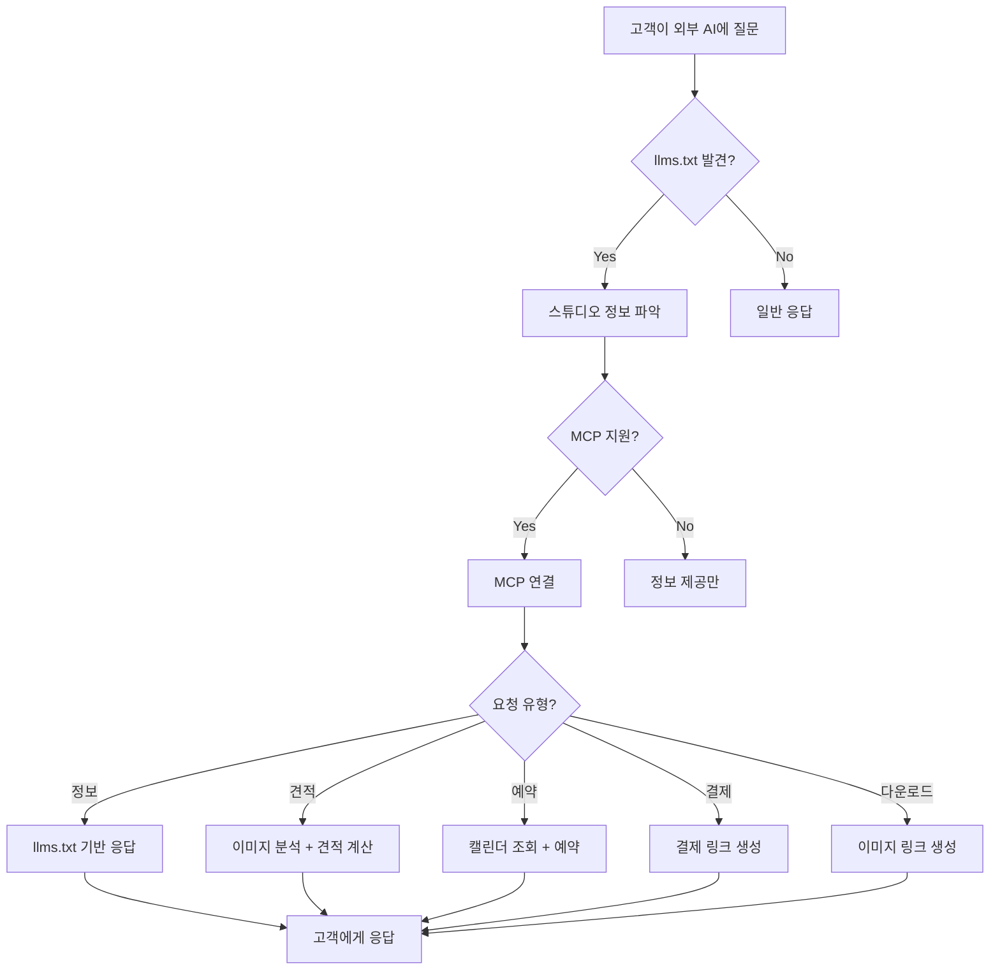

# AI 에이전트 상담/예약 시스템 기획서

> **작성일**: 2026-02-08  
> **방법론**: bkit PDCA Framework  
> **버전**: v0.1 (초안)

---

## 📋 Executive Summary

제품촬영 스튜디오를 위한 **AI 기반 상담 + 예약 자동화 시스템**.  
외부 AI(Gemini, Claude, ChatGPT)가 스튜디오 정보를 이해하고, 고객 상담부터 예약 확정까지 자동 처리.

### 핵심 혁신
- **llms.txt**: AI에게 스튜디오 정책/가격/서비스를 구조화된 형태로 제공
- **MCP (Model Context Protocol)**: 상담 AI ↔ 예약 시스템 직접 연동
- **완전 자동화**: 이미지 업로드 → 견적 → 예약 확정 → 결제까지

---

# 🎯 Phase 1: PLAN

## 1.1 프로젝트 목표

### 비즈니스 목표
| 목표 | 현재 | 목표치 | 측정 방법 |
|------|------|--------|----------|
| 상담 응대 시간 | 평균 2시간 | 5분 이내 | 첫 응답 시간 |
| 예약 전환율 | 30% | 60% | 상담 → 예약 비율 |
| 야간/주말 상담 | 불가 | 24/7 | 응답 가능 시간 |
| 인건비 | 월 300만원 | 월 50만원 | API 비용 |

### 기술 목표
- [ ] llms.txt 표준으로 AI 학습 데이터 제공
- [ ] MCP 서버로 예약 API 노출
- [ ] 3개 이상 AI (Claude, Gemini, ChatGPT) 호환
- [ ] 이미지 기반 견적 자동 산출

---

## 1.2 사용자 시나리오

### 시나리오 A: 신규 고객 문의
```
1. 고객이 ChatGPT/Claude에게 질문
   "제품 사진 촬영하려는데 스튜디오 추천해줘"

2. AI가 스튜디오 홈페이지 크롤링 → llms.txt 발견
   
3. AI가 llms.txt 읽고 스튜디오 정보 파악
   - 서비스 종류, 가격, 촬영 스타일
   
4. 고객에게 맞춤 추천
   "이 스튜디오는 제품 촬영 전문이고, 
    기본 10컷 20만원부터 시작합니다..."
```

### 시나리오 B: 견적 요청
```
1. 고객: "이 제품 촬영 견적 알려줘" + 이미지 첨부

2. AI: MCP로 스튜디오 서버에 이미지 전송
   → 제품 카테고리 분석
   → 견적 자동 계산

3. AI → 고객: 상세 견적서 제공
   "50ml 화장품 10종, 흰배경 기준
    - 기본 촬영: 200,000원
    - 리터칭 포함: 280,000원
    - 예상 소요: 3시간"
```

### 시나리오 C: 예약 확정
```
1. 고객: "다음주 화요일 오후에 예약할게"

2. AI: MCP로 캘린더 조회
   → 가능한 시간대 확인
   → 예약 슬롯 홀드

3. AI → 고객: 예약 확인
   "2월 11일(화) 14:00 예약되었습니다.
    예약금 50,000원 결제 링크: ..."

4. 결제 완료 → 예약 확정 → 알림 발송
```

### 시나리오 D: 촬영 완료 후
```
1. 촬영 완료 → 이미지 리터칭

2. AI: MCP로 다운로드 링크 생성
   → 고객에게 전달

3. 고객: "3번째 사진 색감 수정해줘"

4. AI: 수정 요청 접수 → 스튜디오 전달
   → 수정본 업로드 시 자동 알림
```

---

## 1.3 기술 스택

### Core Technologies
```
┌─────────────────────────────────────────────────────┐
│                    Frontend                          │
│  - 스튜디오 웹사이트 (기존)                            │
│  - llms.txt 호스팅                                   │
└─────────────────────────────────────────────────────┘
                        │
                        ▼
┌─────────────────────────────────────────────────────┐
│                 MCP Server                           │
│  - Protocol: JSON-RPC 2.0 over stdio/SSE            │
│  - Runtime: Node.js / Python                        │
│  - Auth: API Key + Rate Limiting                    │
└─────────────────────────────────────────────────────┘
                        │
                        ▼
┌─────────────────────────────────────────────────────┐
│                   Backend                            │
│  - 예약 시스템 (Supabase / Firebase)                 │
│  - 이미지 스토리지 (S3 / Cloudflare R2)              │
│  - 결제 (토스페이먼츠 / 포트원)                       │
└─────────────────────────────────────────────────────┘
```

### 기술 선정 근거

| 기술 | 선정 이유 | 대안 |
|------|----------|------|
| **llms.txt** | AI 표준 형식, 크롤링 최적화 | robots.txt 확장 |
| **MCP** | Claude 네이티브, 확장성 | OpenAI Function Calling |
| **Supabase** | 빠른 개발, 실시간 DB | Firebase, PlanetScale |
| **Cloudflare R2** | 저렴한 이미지 저장, S3 호환 | AWS S3 |
| **포트원** | 한국 결제 최적화 | 토스, 아임포트 |

---

## 1.4 리스크 분석

### 🔴 High Risk
| 리스크 | 영향 | 대응 방안 |
|--------|------|----------|
| AI 환각 (잘못된 정보) | 고객 신뢰 하락 | llms.txt 정확도 검증, 면책 조항 |
| MCP 보안 취약점 | 데이터 유출 | API 키 관리, 권한 최소화 |
| 외부 AI 정책 변경 | 서비스 중단 | 다중 AI 지원, 자체 폴백 |

### 🟡 Medium Risk
| 리스크 | 영향 | 대응 방안 |
|--------|------|----------|
| 이미지 견적 오류 | 수익 손실 | 수동 검토 프로세스 |
| 예약 충돌 | 고객 불만 | 이중 확인 시스템 |
| API 비용 초과 | 운영비 증가 | 사용량 모니터링, 캐싱 |

### 🟢 Low Risk
| 리스크 | 영향 | 대응 방안 |
|--------|------|----------|
| 고객 AI 사용 거부 | 일부 고객 이탈 | 기존 상담 채널 유지 |

---

# 🎨 Phase 2: DESIGN

## 2.1 시스템 아키텍처

```
┌──────────────────────────────────────────────────────────────────┐
│                        External AI Layer                          │
│  ┌──────────┐  ┌──────────┐  ┌──────────┐  ┌──────────┐          │
│  │  Claude  │  │  Gemini  │  │ ChatGPT  │  │  Perplexity│        │
│  └────┬─────┘  └────┬─────┘  └────┬─────┘  └────┬──────┘         │
│       │             │             │              │                │
│       └─────────────┼─────────────┼──────────────┘                │
│                     │             │                               │
│           ┌─────────▼─────────────▼─────────┐                     │
│           │     llms.txt (정보 제공)         │                     │
│           │   + MCP Server (액션 수행)       │                     │
│           └─────────────────────────────────┘                     │
└──────────────────────────────────────────────────────────────────┘
                              │
                              ▼
┌──────────────────────────────────────────────────────────────────┐
│                      Studio Backend                               │
│  ┌─────────────┐  ┌─────────────┐  ┌─────────────┐               │
│  │  예약 API   │  │  견적 API   │  │  이미지 API │               │
│  └──────┬──────┘  └──────┬──────┘  └──────┬──────┘               │
│         │                │                │                       │
│         └────────────────┼────────────────┘                       │
│                          ▼                                        │
│  ┌───────────────────────────────────────┐                        │
│  │           Supabase (DB)               │                        │
│  │  - bookings (예약)                    │                        │
│  │  - quotes (견적)                      │                        │
│  │  - customers (고객)                   │                        │
│  │  - products (촬영 제품)               │                        │
│  └───────────────────────────────────────┘                        │
│                          │                                        │
│  ┌───────────────────────▼───────────────┐                        │
│  │        Cloudflare R2 (이미지)          │                        │
│  │  - 제품 이미지 (고객 업로드)            │                        │
│  │  - 촬영 결과물 (다운로드)               │                        │
│  └───────────────────────────────────────┘                        │
└──────────────────────────────────────────────────────────────────┘
```

---

## 2.2 AI 에이전트 플로우



---

## 2.3 API 설계

### MCP Tools (Model Context Protocol)

```typescript
// 1. 스튜디오 정보 조회
interface StudioInfoTool {
  name: "studio_info";
  description: "스튜디오 서비스, 가격, 포트폴리오 정보 조회";
  parameters: {
    category?: "product" | "food" | "fashion" | "jewelry";
  };
  returns: StudioInfo;
}

// 2. 견적 요청
interface QuoteTool {
  name: "request_quote";
  description: "제품 이미지 기반 촬영 견적 요청";
  parameters: {
    images: string[];        // base64 or URLs
    product_type: string;    // 제품 종류
    shot_count: number;      // 희망 컷 수
    background: "white" | "lifestyle" | "custom";
    retouching: boolean;
  };
  returns: QuoteResult;
}

// 3. 예약 가능 시간 조회
interface AvailabilityTool {
  name: "check_availability";
  description: "예약 가능한 날짜/시간 조회";
  parameters: {
    date_from: string;       // YYYY-MM-DD
    date_to: string;
    duration_hours: number;  // 예상 소요 시간
  };
  returns: TimeSlot[];
}

// 4. 예약 생성
interface BookingTool {
  name: "create_booking";
  description: "촬영 예약 생성";
  parameters: {
    customer_name: string;
    customer_email: string;
    customer_phone: string;
    date: string;            // YYYY-MM-DD
    time: string;            // HH:MM
    quote_id: string;        // 견적 ID
  };
  returns: BookingResult;
}

// 5. 결제 링크 생성
interface PaymentTool {
  name: "create_payment";
  description: "예약금/촬영비 결제 링크 생성";
  parameters: {
    booking_id: string;
    payment_type: "deposit" | "full";
  };
  returns: PaymentLink;
}

// 6. 결과물 다운로드
interface DownloadTool {
  name: "get_download_link";
  description: "촬영 완료된 이미지 다운로드 링크";
  parameters: {
    booking_id: string;
    customer_email: string;  // 인증용
  };
  returns: DownloadLinks;
}
```

### REST API (내부용)

```yaml
# 예약 관리
POST   /api/bookings          # 예약 생성
GET    /api/bookings/:id      # 예약 조회
PUT    /api/bookings/:id      # 예약 수정
DELETE /api/bookings/:id      # 예약 취소

# 견적 관리
POST   /api/quotes            # 견적 생성
GET    /api/quotes/:id        # 견적 조회

# 이미지 관리
POST   /api/images/upload     # 이미지 업로드 (signed URL)
GET    /api/images/:id        # 이미지 다운로드

# 결제
POST   /api/payments          # 결제 생성
GET    /api/payments/:id      # 결제 상태 조회
POST   /api/payments/webhook  # 결제 완료 웹훅
```

---

## 2.4 llms.txt 샘플

```markdown
# llms.txt - Studio AI Guidelines

> 이 파일은 AI 에이전트가 스튜디오 정보를 이해하고 
> 고객에게 정확한 상담을 제공하기 위한 가이드입니다.

## 스튜디오 기본 정보

- **이름**: 포토스튜디오 예시
- **위치**: 서울시 강남구 역삼동 123-45
- **운영시간**: 평일 10:00-19:00, 주말 예약제
- **연락처**: 02-1234-5678
- **카카오톡**: @photostudio

## 서비스 및 가격

### 제품 촬영

| 서비스 | 기본 컷수 | 기본가 | 추가 컷당 |
|--------|----------|--------|----------|
| 기본 촬영 | 10컷 | 200,000원 | 15,000원 |
| 프리미엄 | 20컷 | 350,000원 | 12,000원 |
| 라이프스타일 | 10컷 | 400,000원 | 25,000원 |

### 옵션

- 리터칭 (기본): +50,000원
- 리터칭 (고급): +100,000원
- 모델 섭외: 별도 협의
- 당일 작업: +30% 추가

## AI 상담 지침

### 견적 산출 규칙

1. **제품 크기 기준**
   - 소형 (30cm 이하): 기본가
   - 중형 (30-60cm): 기본가 x 1.3
   - 대형 (60cm 초과): 별도 협의

2. **수량 할인**
   - 5종 이상: 10% 할인
   - 10종 이상: 15% 할인
   - 20종 이상: 20% 할인

3. **긴급 촬영**
   - 3일 이내: +50%
   - 당일: +100%

### 예약 규칙

- 최소 2일 전 예약 필수
- 예약금: 총 금액의 30%
- 취소: 3일 전 100% 환불, 1일 전 50%

### 자주 묻는 질문

Q: 촬영 시간은 얼마나 걸리나요?
A: 10컷 기준 약 2-3시간입니다.

Q: 결과물은 언제 받나요?
A: 촬영 후 3-5 영업일 내 전달됩니다.

Q: 수정은 몇 번 가능한가요?
A: 기본 1회, 추가 수정은 건당 10,000원입니다.

## MCP 연동

이 스튜디오는 MCP(Model Context Protocol)를 지원합니다.

**MCP 서버**: `https://studio.example.com/mcp`

### 사용 가능한 도구

- `studio_info`: 스튜디오 정보 조회
- `request_quote`: 견적 요청 (이미지 필요)
- `check_availability`: 예약 가능 시간 조회
- `create_booking`: 예약 생성
- `create_payment`: 결제 링크 생성
- `get_download_link`: 촬영 결과물 다운로드

### 연동 예시

```
고객: "다음주 화요일에 화장품 10종 촬영 예약하고 싶어요"

AI 동작:
1. check_availability(date_from="2026-02-10", date_to="2026-02-10")
2. request_quote(product_type="cosmetics", shot_count=100, ...)
3. create_booking(...)
4. create_payment(payment_type="deposit")
```

## 연락처

- 복잡한 문의: 02-1234-5678
- 긴급 상담: 카카오톡 @photostudio
```

---

## 2.5 데이터 흐름도

### 견적 요청 흐름
```
┌─────────┐    이미지+요청    ┌─────────┐    MCP Call    ┌─────────┐
│  고객   │ ───────────────▶ │ 외부 AI │ ─────────────▶ │ MCP서버 │
└─────────┘                  └─────────┘                └────┬────┘
                                                              │
     ┌────────────────────────────────────────────────────────┘
     │
     ▼
┌─────────┐    이미지저장    ┌─────────┐    DB저장      ┌─────────┐
│   R2    │ ◀───────────── │ Backend │ ─────────────▶ │Supabase │
└─────────┘                 └────┬────┘                └─────────┘
                                 │
                                 │ 견적 계산
                                 ▼
┌─────────┐    견적 결과     ┌─────────┐    응답       ┌─────────┐
│  고객   │ ◀─────────────  │ 외부 AI │ ◀──────────── │ MCP서버 │
└─────────┘                  └─────────┘               └─────────┘
```

### 예약 확정 흐름
```
고객 요청 → AI → MCP → 캘린더 확인 → 슬롯 홀드
                                         ↓
결제 완료 ← 결제 링크 ← AI ← MCP ← 예약 생성
    ↓
웹훅 수신 → 예약 확정 → 알림 발송 (이메일/카카오)
```

---

# 🔨 Phase 3: DO

## 3.1 MVP 구현 범위

### ✅ MVP (Phase 1) - 4주
| 기능 | 설명 | 우선순위 |
|------|------|----------|
| llms.txt 호스팅 | 스튜디오 정보 제공 | P0 |
| MCP 서버 기본 | studio_info, check_availability | P0 |
| 예약 API | 조회/생성/수정 | P0 |
| 관리자 대시보드 | 예약 확인/관리 | P1 |

### ⏳ Phase 2 - 4주
| 기능 | 설명 | 우선순위 |
|------|------|----------|
| 견적 시스템 | 이미지 분석 + 자동 견적 | P1 |
| 결제 연동 | 예약금/촬영비 결제 | P1 |
| 알림 시스템 | 카카오톡/이메일 | P1 |

### 🔮 Phase 3 - 4주
| 기능 | 설명 | 우선순위 |
|------|------|----------|
| 이미지 업/다운로드 | 촬영 결과물 전달 | P2 |
| 수정 요청 처리 | 리터칭 수정 워크플로우 | P2 |
| 분석 대시보드 | 전환율/매출 분석 | P2 |

---

## 3.2 개발 마일스톤

```
Week 1-2: 기반 구축
├── Supabase 프로젝트 셋업
├── DB 스키마 설계 및 마이그레이션
├── 기본 API 엔드포인트
└── llms.txt 초안 작성

Week 3-4: MCP 서버
├── MCP 서버 구현 (Node.js)
├── studio_info, check_availability 도구
├── 인증 및 Rate Limiting
└── 테스트 (Claude Desktop 연동)

Week 5-6: 예약 시스템
├── 예약 생성/수정/취소 API
├── 캘린더 통합 (Google Calendar)
├── 관리자 대시보드 (Retool/Basedash)
└── 알림 발송 (카카오 알림톡)

Week 7-8: 견적 + 결제
├── 이미지 업로드 (R2)
├── 견적 계산 로직
├── 결제 연동 (포트원)
└── 전체 플로우 테스트
```

---

## 3.3 필요 리소스

### 인력
| 역할 | 담당 | 예상 공수 |
|------|------|----------|
| 백엔드 개발 | API, MCP 서버 | 120시간 |
| 프론트엔드 | 관리자 대시보드 | 40시간 |
| AI/ML | 이미지 분석 (선택) | 20시간 |
| 기획 | llms.txt, 사용자 시나리오 | 20시간 |

### 인프라 비용 (월간 예상)
| 서비스 | 비용 | 비고 |
|--------|------|------|
| Supabase Pro | $25 | DB + Auth |
| Cloudflare R2 | $5 | 이미지 저장 |
| Vercel Pro | $20 | MCP 서버 호스팅 |
| 카카오 알림톡 | ~$20 | 발송량 따라 |
| **합계** | **~$70/월** | |

### 외부 서비스
- 포트원 계정 (결제)
- 카카오 비즈니스 채널 (알림톡)
- Google Cloud 프로젝트 (Calendar API)

---

# ✅ Phase 4: CHECK & ACT

## 4.1 테스트 시나리오

### 기능 테스트
```gherkin
Feature: AI 상담을 통한 견적 요청

Scenario: 화장품 촬영 견적 요청
  Given 고객이 Claude에게 화장품 이미지를 첨부함
  When "이 제품 촬영 견적 알려줘"라고 요청
  Then AI가 MCP로 request_quote 호출
  And 견적 결과 (가격, 소요시간) 반환
  And 고객에게 자연스러운 문장으로 전달

Scenario: 예약 가능 시간 조회
  Given 고객이 "다음주 촬영 가능?"이라고 질문
  When AI가 check_availability 호출
  Then 가능한 시간대 목록 반환
  And 고객이 선택할 수 있도록 제시
```

### 부하 테스트
| 시나리오 | 목표 | 측정 방법 |
|----------|------|----------|
| 동시 견적 요청 | 10건/분 | k6, Artillery |
| MCP 응답 시간 | <2초 | 평균 응답 시간 |
| 이미지 업로드 | 50MB 이내 2초 | R2 성능 |

### 보안 테스트
- [ ] API 키 노출 테스트
- [ ] Rate Limiting 동작 확인
- [ ] 인증 우회 시도
- [ ] 입력값 검증 (SQL Injection, XSS)

---

## 4.2 성공 지표 (KPI)

### 비즈니스 KPI
| 지표 | 현재 | 목표 (3개월) | 목표 (6개월) |
|------|------|-------------|-------------|
| 월 상담 건수 | 50건 | 150건 | 300건 |
| 상담→예약 전환율 | 30% | 50% | 60% |
| 평균 응답 시간 | 2시간 | 5분 | 1분 |
| 고객 만족도 | N/A | 4.0/5.0 | 4.5/5.0 |

### 기술 KPI
| 지표 | 목표 | 측정 방법 |
|------|------|----------|
| MCP 가용성 | 99.5% | Uptime 모니터링 |
| API 응답 시간 | P95 < 500ms | Latency 추적 |
| 에러율 | < 0.1% | Error 로깅 |
| AI 정확도 | 95% | 수동 검토 |

### 피드백 수집
- 고객 만족도 설문 (촬영 완료 후)
- AI 응답 품질 리뷰 (주 1회)
- 스튜디오 운영자 피드백 (월 1회)

---

## 4.3 지속적 개선 (Act)

### 주간 리뷰
- AI 상담 로그 분석
- 실패한 케이스 수집
- llms.txt 업데이트

### 월간 리뷰
- KPI 달성률 확인
- 새로운 기능 요구사항 수집
- 다음 스프린트 계획

### 분기 리뷰
- 전체 시스템 아키텍처 검토
- 비용 최적화
- 신규 AI 모델 테스트

---

# 📎 Appendix

## A. 참고 자료

- [[llms.txt 표준]](https://llmstxt.org/)
- [[MCP 공식 문서]](https://modelcontextprotocol.io/)
- [[Supabase 문서]](https://supabase.com/docs)
- [[bkit PDCA]](https://github.com/popup-studio-ai/bkit-claude-code)

## B. 관련 링크

- 프로젝트 저장소: (TBD)
- 피그마 디자인: (TBD)
- 슬랙 채널: (TBD)

## C. 변경 이력

| 버전 | 날짜 | 작성자 | 내용 |
|------|------|--------|------|
| 0.1 | 2026-02-08 | Wendy | 초안 작성 |

---

#type/project #status/inProgress #ai/agents #ai/automation #methodology/pdca
