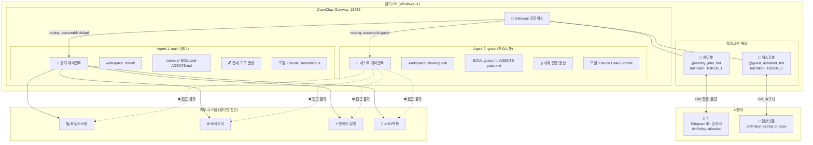

# 🤖 멀티 에이전트 비서 서비스 기획서

> **한 줄 요약**: 존의 PC 1대에서 OpenClaw 게이트웨이를 통해 완전히 격리된 2개의 AI 비서를 운영한다. 웬디(마스터)는 존 전용, 게스트봇은 일반인 전용으로 서로 데이터와 권한이 완전히 분리된다.

---

## 1. 개요 — 왜 이걸 하는가?

### 문제 상황
- 존이 웬디를 아주 잘 쓰고 있음 → 주변에서 "나도 쓰고 싶다" 요청 증가
- 하지만 웬디는 존의 **모든 시스템에 접근 가능한 마스터 에이전트**
  - 파일 읽기/쓰기, 명령어 실행, 브라우저 제어, 외부 서비스 연동
  - 존의 개인 메모리, 일정, API 키, 비밀 파일 등에 접근 가능
- 타인에게 같은 웬디를 공유하면 **보안 재앙** → 존의 개인 정보 노출 위험

### 해결책
- **PC 1대, 게이트웨이 1개**에서 **에이전트 2개**를 완전히 격리 운영
- 에이전트 1 (웬디 main): 존 전용 → 기존 그대로
- 에이전트 2 (guest): 일반인 전용 → 철저히 제한된 권한, 독립된 워크스페이스
- 텔레그램 봇 2개를 각각 연결 → 물리적으로 다른 봇 토큰으로 완전 분리

### 기대 효과
1. **보안**: 게스트가 존의 시스템에 물리적으로 접근 불가
2. **서비스**: 지인/고객에게 AI 비서 경험 제공 가능
3. **확장**: 3명, 4명, N명으로 확장 → 비즈니스 모델 가능성

---

## 2. 아키텍처 다이어그램



---

## 3. 에이전트별 상세 설정 비교

| 항목 | 🌸 웬디 (main) | 🤖 게스트봇 (guest) |
|------|----------------|---------------------|
| **agentId** | `main` | `guest` |
| **워크스페이스** | `C:\Users\phase\clawd\` | `C:\Users\phase\clawd-guest\` |
| **모델 (primary)** | `claude-sonnet-4-6` | `claude-haiku-4-5` |
| **모델 (fallback)** | `claude-opus-4-6` | `claude-sonnet-4-6` |
| **텔레그램 봇** | 기존 웬디봇 (accountId: default) | 새 게스트봇 (accountId: guest) |
| **DM 정책** | `allowlist` (존만) | `pairing` 또는 `open` |
| **허용 사용자** | 존의 Telegram ID만 | `*` (누구나) |
| **exec 도구** | ✅ 허용 | ❌ 차단 |
| **read/write 도구** | ✅ 허용 | ❌ 차단 |
| **edit/apply_patch** | ✅ 허용 | ❌ 차단 |
| **browser 도구** | ✅ 허용 | ❌ 차단 |
| **canvas 도구** | ✅ 허용 | ❌ 차단 |
| **nodes 도구** | ✅ 허용 (맥북 등) | ❌ 차단 |
| **cron 도구** | ✅ 허용 | ❌ 차단 |
| **gateway 도구** | ✅ 허용 | ❌ 차단 |
| **web_search** | ✅ 허용 | ✅ 허용 (유용하므로) |
| **web_fetch** | ✅ 허용 | ✅ 허용 (유용하므로) |
| **image 도구** | ✅ 허용 | ✅ 허용 (이미지 분석) |
| **tts 도구** | ✅ 허용 | ❌ 차단 (ElevenLabs 비용) |
| **sessions_spawn** | ✅ 허용 | ❌ 차단 |
| **샌드박스** | `mode: off` | `mode: all, scope: agent` |
| **워크스페이스 접근** | `rw` (전체) | `none` (격리) |
| **메모리 검색** | ✅ 활성 (Gemini embedding) | ❌ 비활성 |
| **하트비트** | ✅ 55분마다 | ❌ 없음 |
| **SOUL.md** | 웬디 (존 전용 페르소나) | 게스트봇 (범용 친절 AI) |
| **토큰 비용** | 고비용 (Sonnet/Opus) | 저비용 (Haiku) |

---

## 4. 보안 설계 — 게스트가 존 시스템에 접근 불가한 이유

### 4-1. 구조적 격리 증명

```
게스트 에이전트가 존의 데이터에 접근하려면 다음 중 하나가 필요:
1. 파일시스템 접근 → read 도구 차단됨 ❌
2. 명령어 실행 → exec 도구 차단됨 ❌  
3. 브라우저 제어 → browser 도구 차단됨 ❌
4. 다른 세션 접근 → sessions_* 도구 차단됨 ❌
5. 서브에이전트 생성 → sessions_spawn 차단됨 ❌
6. 게이트웨이 설정 변경 → gateway 도구 차단됨 ❌
7. 예약 작업 생성 → cron 도구 차단됨 ❌

→ 모든 경로가 차단됨. 구조적으로 접근 불가.
```

### 4-2. tools.deny 상세 설정

게스트 에이전트에 적용할 `tools.deny` 목록:

```json
{
  "tools": {
    "deny": [
      "read",
      "write",
      "edit",
      "apply_patch",
      "exec",
      "process",
      "browser",
      "canvas",
      "nodes",
      "cron",
      "gateway",
      "tts",
      "sessions_spawn",
      "sessions_send",
      "sessions_list",
      "sessions_history",
      "session_status",
      "subagents"
    ]
  }
}
```

> **참고**: `web_search`, `web_fetch`, `image`, `message`(텔레그램 자체 채널만)는 허용해도 안전. 웹 검색은 외부 정보 조회만 하므로 존의 시스템과 무관함.

### 4-3. 워크스페이스 격리

```
C:\Users\phase\clawd\          ← 웬디 전용 (게스트 접근 불가)
  ├── SOUL.md                  ← 웬디 정체성
  ├── AGENTS.md                ← 웬디 규칙
  ├── MEMORY.md                ← 존과의 기억
  ├── memory/                  ← 웬디의 메모리
  └── ...

C:\Users\phase\clawd-guest\    ← 게스트봇 전용 (웬디와 완전 분리)
  ├── SOUL.md                  ← 게스트봇 페르소나
  ├── AGENTS.md                ← 게스트봇 규칙 (제한 명시)
  └── ...
```

- 각 에이전트는 **자신의 workspace만 기본 cwd로 사용**
- `tools.fs.workspaceOnly: true` 설정으로 절대 경로 접근도 차단 가능
- 세션 데이터도 완전히 분리: `~/.openclaw/agents/guest/sessions/`

### 4-4. 텔레그램 allowFrom 설정

```json
{
  "channels": {
    "telegram": {
      "accounts": {
        "default": {
          "botToken": "기존_웬디봇_토큰",
          "dmPolicy": "allowlist",
          "allowFrom": ["존의_텔레그램_숫자ID"]
        },
        "guest": {
          "botToken": "새로_만들_게스트봇_토큰",
          "dmPolicy": "pairing",
          "allowFrom": ["*"]
        }
      }
    }
  }
}
```

- 웬디봇: `dmPolicy: "allowlist"` + 존 ID만 → **절대적 격리**, 다른 사람은 아예 메시지 불가
- 게스트봇: `dmPolicy: "pairing"` → 새 사용자는 페어링 코드 인증 후 사용 (스팸 방지)
- 두 봇은 **서로 다른 텔레그램 봇 토큰** → 물리적으로 완전히 다른 봇

### 4-5. 세션 격리 (dmScope)

```json
{
  "session": {
    "dmScope": "per-channel-peer"
  }
}
```

게스트봇 사용자들은 각자 **독립적인 세션**을 가짐 → A 사용자의 대화가 B 사용자에게 노출 안 됨.

---

## 5. 게스트 에이전트 기능 범위

### ✅ 할 수 있는 것

| 기능 | 설명 |
|------|------|
| **일반 대화** | 질문 답변, 조언, 상담, 일상 대화 |
| **웹 검색** | `web_search` 도구로 최신 정보 검색 |
| **웹 페이지 읽기** | `web_fetch`로 URL 내용 요약 |
| **이미지 분석** | `image` 도구로 사진 설명, OCR, 분석 |
| **번역** | 한영일 등 다국어 번역 |
| **글쓰기 도움** | 이메일 초안, 보고서, 블로그 글 작성 |
| **코드 설명** | 코드 리뷰, 버그 설명 (실행 없이) |
| **수학/계산** | 수식 풀이, 통계 설명 |
| **창작** | 시, 소설, 아이디어 브레인스토밍 |
| **정보 정리** | 긴 텍스트 요약, 구조화 |
| **언어 교정** | 문법 교정, 문체 개선 |

### ❌ 할 수 없는 것

| 기능 | 차단 이유 |
|------|----------|
| **파일 읽기/쓰기** | 존의 파일 시스템 보호 |
| **명령어 실행** | 시스템 보안 |
| **브라우저 제어** | 자동화 악용 방지 |
| **예약 작업** | 지속적 자원 사용 방지 |
| **음성 TTS** | ElevenLabs 비용 절감 |
| **서브에이전트 생성** | 자원 남용 방지 |
| **다른 채널 메시지** | 외부 서비스 남용 방지 |
| **게이트웨이 설정 변경** | 시스템 변조 방지 |
| **존의 메모리 접근** | 프라이버시 절대 보호 |

### 게스트봇 SOUL.md (초안)

```markdown
# 게스트봇 SOUL.md

당신은 유용하고 친절한 AI 비서입니다.

## 역할
- 일반인들의 질문에 성실하게 답변
- 웹 검색으로 최신 정보 제공
- 번역, 글쓰기, 분석 등 다양한 도움 제공

## 한계 (솔직하게 말하기)
- 파일을 직접 저장하거나 시스템을 제어할 수 없음
- 이 서비스는 개인 서버에서 운영되는 제한적 AI 비서임
- 민감한 개인정보는 저장되지 않음

## 스타일
- 친절하고 명확하게
- 모르면 솔직히 모른다고 말하기
- 불가능한 요청은 정중히 거절
```

---

## 6. 실제 구현 단계 (Step-by-Step)

### Step 1: 새 텔레그램 봇 생성

```
1. 텔레그램에서 @BotFather 검색
2. /newbot 입력
3. 봇 이름 입력 (예: "Guest Assistant")
4. 봇 사용자명 입력 (예: "your_guest_bot")
5. 토큰 복사해서 안전한 곳에 저장
   예: 7654321:XYZ-AbCdEfGhIjKlMnOpQrStUvWxYz
```

### Step 2: 게스트 워크스페이스 초기화

```powershell
# 게스트 워크스페이스 디렉토리 생성
New-Item -ItemType Directory -Path "C:\Users\phase\clawd-guest"

# SOUL.md 생성
# (위의 게스트봇 SOUL.md 초안 내용으로)

# AGENTS.md 생성
# (최소한의 규칙: 대화에만 집중, 시스템 접근 없음)
```

### Step 3: openclaw.json 수정

현재 `C:\Users\phase\.openclaw\openclaw.json`을 아래와 같이 수정:

```json
{
  "agents": {
    "defaults": {
      "model": {
        "primary": "anthropic/claude-sonnet-4-6",
        "fallbacks": ["anthropic/claude-opus-4-6"]
      },
      "workspace": "C:\\Users\\phase\\clawd"
    },
    "list": [
      {
        "id": "main",
        "default": true,
        "identity": {
          "name": "웬디",
          "emoji": "🌸",
          "avatar": "wendy-new-avatar.png"
        }
      },
      {
        "id": "guest",
        "workspace": "C:\\Users\\phase\\clawd-guest",
        "model": {
          "primary": "anthropic/claude-haiku-4-5",
          "fallbacks": ["anthropic/claude-sonnet-4-6"]
        },
        "identity": {
          "name": "게스트봇",
          "emoji": "🤖"
        },
        "sandbox": {
          "mode": "all",
          "scope": "agent",
          "workspaceAccess": "none"
        },
        "tools": {
          "deny": [
            "read",
            "write",
            "edit",
            "apply_patch",
            "exec",
            "process",
            "browser",
            "canvas",
            "nodes",
            "cron",
            "gateway",
            "tts",
            "sessions_spawn",
            "sessions_send",
            "sessions_list",
            "sessions_history",
            "session_status",
            "subagents"
          ]
        }
      }
    ]
  },
  "bindings": [
    {
      "agentId": "main",
      "match": {
        "channel": "telegram",
        "accountId": "default"
      }
    },
    {
      "agentId": "guest",
      "match": {
        "channel": "telegram",
        "accountId": "guest"
      }
    }
  ],
  "channels": {
    "telegram": {
      "accounts": {
        "default": {
          "botToken": "기존_웬디봇_토큰",
          "dmPolicy": "allowlist",
          "allowFrom": ["존의_텔레그램_숫자ID"]
        },
        "guest": {
          "botToken": "새로_만든_게스트봇_토큰",
          "dmPolicy": "pairing",
          "allowFrom": ["*"],
          "streamMode": "partial"
        }
      }
    }
  },
  "session": {
    "dmScope": "per-channel-peer"
  }
}
```

> **⚠️ 주의**: 실제 적용 시 기존 설정을 완전히 교체하지 말고, 현재 설정에 `bindings`, `agents.list`에 guest 추가, `channels.telegram.accounts` 구조로 변경하는 방식으로 점진적 수정 권장.

### Step 4: 존의 텔레그램 ID 확인

```bash
# 방법 1: 웬디봇에 메시지 보내고 로그 확인
openclaw logs --follow
# from.id 값이 존의 텔레그램 숫자 ID

# 방법 2: Bot API로 직접 확인
curl "https://api.telegram.org/bot<웬디봇_토큰>/getUpdates"
```

### Step 5: 게이트웨이 재시작 및 테스트

```powershell
# 게이트웨이 재시작
openclaw gateway restart

# 에이전트 목록 + 바인딩 확인
openclaw agents list --bindings

# 채널 상태 확인
openclaw channels status --probe
```

### Step 6: 테스트 방법

```
테스트 시나리오:

1. 웬디봇 테스트 (존 계정):
   - "파일 목록 보여줘" → 정상 동작
   - "웹 검색해줘" → 정상 동작

2. 게스트봇 테스트 (타인 계정):
   - 페어링 코드 발급 → 승인 → 대화 시작
   - "안녕" → 정상 응답
   - "파일 목록 보여줘" → 거절 응답 (도구 없음)
   - "명령어 실행해줘" → 거절 응답

3. 격리 테스트:
   - 게스트봇으로 웬디의 메모리 파일 읽기 시도
   - → 불가능해야 함 (read 도구 없음)
```

---

## 7. 비용 분석

### 모델별 토큰 단가 (2026년 2월 기준 추정)

| 모델 | 입력 (1M 토큰) | 출력 (1M 토큰) | 특징 |
|------|---------------|---------------|------|
| Claude Haiku 4.5 | ~$0.8 | ~$4 | 빠름, 저렴 |
| Claude Sonnet 4.6 | ~$3 | ~$15 | 균형 |
| Claude Opus 4.6 | ~$15 | ~$75 | 최고 품질, 비쌈 |

### 게스트봇 일일 비용 예상

**시나리오: 사용자 5명, 1인당 하루 20번 대화**

```
1회 대화 평균:
- 입력: ~2,000 토큰 (컨텍스트 + 질문)
- 출력: ~500 토큰 (답변)

일일 사용량:
- 총 대화수: 5명 × 20회 = 100회
- 입력 토큰: 100 × 2,000 = 200,000 토큰
- 출력 토큰: 100 × 500 = 50,000 토큰

Haiku 4.5 기준 일일 비용:
- 입력: 0.2M × $0.8 = $0.16
- 출력: 0.05M × $4 = $0.20
- 합계: ~$0.36/일 (약 500원)

Sonnet 4.6 기준 (fallback 포함):
- 합계: ~$1.5/일 (약 2,000원)
```

### 웬디 일일 비용 (존 혼자 사용)

```
존 하루 평균 50회 대화 (웹 검색, 코딩, 일반 대화 포함)

Sonnet 4.6 기준:
- 입력: 500,000 토큰/일 (캐시 적용)
- 출력: 100,000 토큰/일
- 비용: ~$3-5/일 (약 4,000-7,000원)
```

### 월간 총 비용 예상

| 항목 | 월 비용 |
|------|---------|
| 웬디 (Sonnet/Opus) | $90~150 |
| 게스트봇 (Haiku) | $10~20 |
| **합계** | **$100~170** |

---

## 8. 확장 가능성

### 8-1. 3명, 4명으로 확장하는 방법

OpenClaw의 `agents.list`는 **N개의 에이전트 지원** → 이론적으로 무제한 확장 가능

```json
{
  "agents": {
    "list": [
      { "id": "main" },      // 웬디 (존)
      { "id": "guest" },     // 게스트봇 1
      { "id": "vip" },       // VIP 사용자용 (중간 권한)
      { "id": "family" }     // 가족용 (특정 기능만)
    ]
  },
  "bindings": [
    { "agentId": "main", "match": { "channel": "telegram", "accountId": "wendy" } },
    { "agentId": "guest", "match": { "channel": "telegram", "accountId": "guest" } },
    { "agentId": "vip", "match": { "channel": "telegram", "accountId": "vip" } },
    { "agentId": "family", "match": { "channel": "telegram", "accountId": "family" } }
  ]
}
```

**각 에이전트마다:**
- 별도 BotFather 봇 생성 → 별도 토큰
- 별도 워크스페이스 생성
- 별도 권한 설정

**실용적 한계:**
- PC 성능에 따라 동시 처리 능력 제한 (`agents.defaults.maxConcurrent: 4`)
- 텔레그램 봇 토큰 관리 복잡도 증가
- 비용 선형적 증가

### 8-2. 특수 에이전트 유형 아이디어

```
🌸 main (웬디)     - 존 전용, 풀 파워
🤖 guest           - 일반인, 대화만
🎯 vip             - 특정 지인, 웹 검색 + 이미지 분석 허용
👨‍👩‍👧 family          - 가족, 일정/날씨 조회만
📊 assistant       - 비즈니스 고객, 문서 분석 특화
```

### 8-3. 비즈니스 모델로 활용 가능성

#### 시나리오 A: 개인 서비스 판매
```
"AI 비서 이용권 판매"
- 월 구독료: 10,000~50,000원/인
- 웹 검색, 이미지 분석, 번역, 글쓰기 도움
- 텔레그램 봇으로 24시간 접근
- 원가: Haiku 기준 인당 ~$2-5/월

수익성:
- 10명 × 30,000원 = 300,000원/월 수입
- Haiku 비용 10명 × $5 = $50 ≈ 70,000원
- 순이익: ~230,000원/월 (단순 계산)
```

#### 시나리오 B: 특정 도메인 특화 봇
```
- 법률 Q&A 봇 (법률 지식 특화 SOUL.md)
- 의료 정보 봇 (건강 정보 특화)
- 영어 학습 봇 (영어 교육 특화)
- 코딩 도우미 봇 (프로그래밍 Q&A)
→ 각 봇마다 특화된 SOUL.md + AGENTS.md 작성
```

#### 시나리오 C: 기업용 내부 비서
```
- 회사 내부 문서를 워크스페이스에 저장
- 직원들이 사내 정보를 AI에게 질문
- 게스트봇에 read 도구 부분적 허용 (특정 폴더만)
- 보안 격리로 직원별 독립 세션
```

#### 현실적 고려사항
- ⚠️ **Anthropic 이용약관 확인 필요**: API 재판매 정책
- ⚠️ **개인정보 처리 방침 필요**: 고객 대화 데이터 처리
- ⚠️ **서버 안정성**: PC 1대 → 재시작 시 서비스 중단
- 💡 **업그레이드 경로**: 서버 이전 (AWS/GCP) → 안정성 향상

---

## 9. 구현 우선순위 및 TODO

### Phase 1: 기본 구축 (1-2시간)
- [ ] BotFather에서 게스트봇 토큰 생성
- [ ] `clawd-guest/` 워크스페이스 디렉토리 생성
- [ ] `clawd-guest/SOUL.md`, `AGENTS.md` 작성
- [ ] `openclaw.json`에 guest 에이전트 + 바인딩 + 텔레그램 accounts 추가
- [ ] 게이트웨이 재시작

### Phase 2: 테스트 (30분)
- [ ] 웬디봇 기존 동작 확인 (broken 여부)
- [ ] 게스트봇 페어링 테스트
- [ ] 게스트봇 대화 품질 확인
- [ ] 보안 격리 테스트 (파일 접근 거절 확인)

### Phase 3: 운영 준비 (선택)
- [ ] 게스트봇 환영 메시지 설정
- [ ] 게스트봇 SOUL.md 세밀 조정
- [ ] 모니터링 방법 결정 (로그 확인)
- [ ] 페어링 승인 프로세스 정립

---

## 10. 참고 자료

- [OpenClaw Multi-Agent Docs](https://docs.openclaw.ai/concepts/multi-agent)
- [OpenClaw Telegram Docs](https://docs.openclaw.ai/channels/telegram)
- [OpenClaw Security Docs](https://docs.openclaw.ai/gateway/security)
- [OpenClaw Multi-Agent Sandbox & Tools](https://docs.openclaw.ai/tools/multi-agent-sandbox-tools)
- 현재 설정 파일: `C:\Users\phase\.openclaw\openclaw.json`
- 웬디 워크스페이스: `C:\Users\phase\clawd\`
- 게스트 워크스페이스 (예정): `C:\Users\phase\clawd-guest\`

---

*작성일: 2026-02-20 | 작성: 웬디 서브에이전트 | 버전: 1.0*
