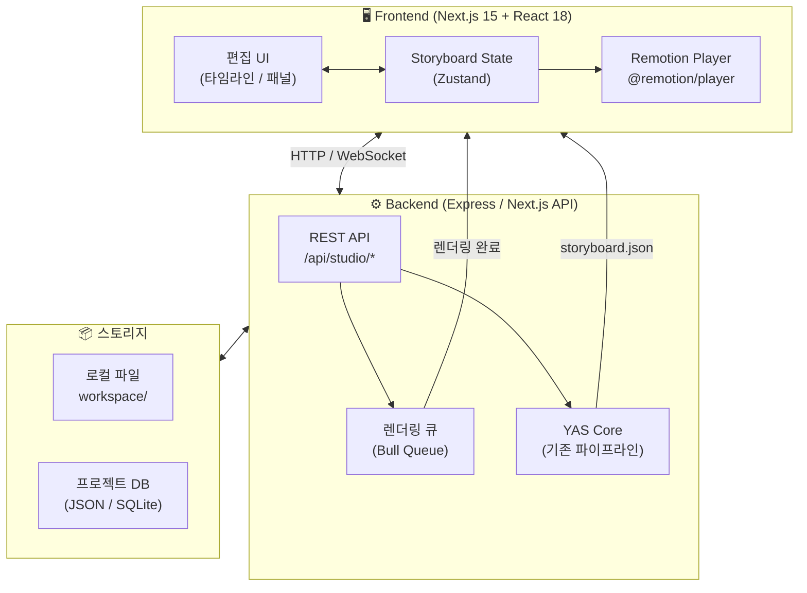
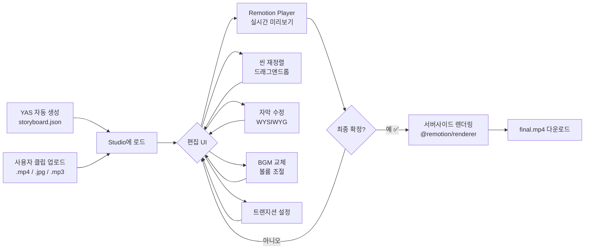
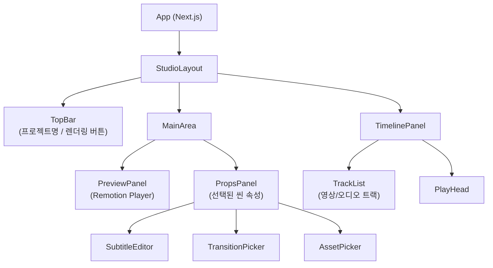
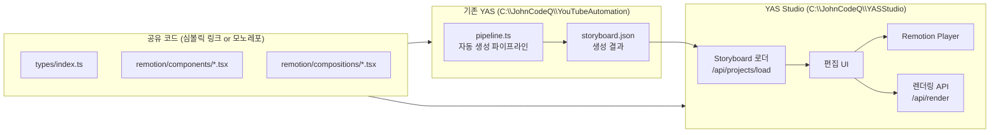

# 🎬 YAS 영상 편집 스튜디오 웹앱 기획서

> **핵심 컨셉**: YAS가 자동 생성한 영상을 존이 직접 미리보고, 필요한 부분을 GUI로 수정한 뒤, **단 1번의 렌더링**으로 최종 영상을 뽑아내는 웹 기반 편집 스튜디오

---

## 1. 프로젝트 개요

### 프로젝트명
**YAS Studio** (YouTube Automation System Studio)
- 부제: *See Before You Render*

### 배경 & 목적

현재 YAS(`C:\JohnCodeQ\YouTubeAutomation`)는 완전 자동으로 영상을 생성하지만, 존이 중간에 개입할 수 없다.

| 현재 YAS | YAS Studio (목표) |
|---------|-----------------|
| 블랙박스 자동 생성 | 실시간 미리보기 후 편집 |
| 렌더링 후에야 결과 확인 | **편집 중 즉시 확인** |
| 스크립트/스토리보드 파일 직접 수정 | **GUI 드래그앤드롭 편집** |
| AI가 결정한 내용 그대로 출력 | **존이 최종 결정** |

### 핵심 가치
1. **Zero Render Preview**: 렌더링 없이 실시간으로 결과 확인
2. **One-Click Render**: 확정 후 단 1번만 렌더링
3. **YAS Integration**: 기존 YAS 코드 최대 재사용
4. **Upload & Edit**: 직접 소스 업로드해서도 편집 가능

---

## 2. 현재 YAS 코드 분석

### 2.1 기술 스택 (현재)

```
Remotion v4.0.x
React v18.3.x
TypeScript v5.6.x
Node.js
@remotion/bundler, @remotion/cli, @remotion/renderer
@remotion/google-fonts (NotoSansKR)
Winston (로깅)
Zod (유효성 검사)
```

### 2.2 핵심 데이터 구조

```typescript
// 현재 YAS의 핵심 타입 (그대로 재사용 가능)
interface Scene {
  id: number;
  type: 'image' | 'video';
  duration: number;        // 초 단위
  script: string;          // 자막 텍스트
  visual_prompt: string;   // AI 이미지 생성 프롬프트
  assets: {
    image?: string;        // 로컬 파일 경로
    video?: string;
    audio?: string;        // TTS 오디오
  };
  transition: 'fade' | 'slide' | 'none';
}

interface Storyboard {
  title: string;
  scenes: Scene[];
  bgm?: { file: string; volume: number };
}
```

### 2.3 현재 Remotion 컴포지션 구조

```
src/remotion/
├── Root.tsx                    ← Composition 등록 (MainVideo)
├── render.ts                   ← 서버사이드 렌더링 로직
├── utils.ts
├── index.ts
├── compositions/
│   ├── MainVideo.tsx           ← 1920×1080 (16:9)
│   └── ShortsVideo.tsx         ← 세로형 Shorts
└── components/
    ├── SceneImage.tsx          ← 씬 이미지 표시
    ├── SceneAudio.tsx          ← TTS 오디오 재생
    └── SubtitleOverlay.tsx     ← 자막 오버레이 (NotoSansKR)
```

### 2.4 재사용 가능한 코드

| 컴포넌트 | 재사용 여부 | 비고 |
|---------|-----------|------|
| `MainVideo.tsx` | ✅ 그대로 사용 | Player에 props만 바꿔서 실시간 미리보기 |
| `ShortsVideo.tsx` | ✅ 그대로 사용 | Shorts 편집 모드 |
| `SubtitleOverlay.tsx` | ✅ 재사용 + 확장 | WYSIWYG 자막 편집 |
| `SceneImage.tsx` | ✅ 재사용 | 클립 업로드 연동 |
| `SceneAudio.tsx` | ✅ 재사용 | BGM/TTS 연동 |
| Storyboard 타입 | ✅ 완전 재사용 | Studio state의 핵심 |
| `render.ts` | ✅ 서버에서 재사용 | 최종 렌더링 트리거 |

---

## 3. 아키텍처

### 3.1 전체 시스템 구조



### 3.2 편집 플로우



### 3.3 컴포넌트 구조



---

## 4. 핵심 기능 명세

### 4.1 영상 소스 업로드 & 관리

**기능:**
- 드래그앤드롭으로 클립 업로드 (`.mp4`, `.mov`, `.jpg`, `.png`, `.mp3`, `.wav`)
- 썸네일 자동 생성
- 미디어 라이브러리 패널에서 관리
- YAS 생성 에셋 자동 임포트 (workspace 폴더 연동)

**구현:**
```
클라이언트 → POST /api/upload → multer → workspace/studio/uploads/
```

---

### 4.2 타임라인 편집 (드래그앤드롭)

**기능:**
- 씬(Scene) 단위 블록 표시
- 드래그앤드롭으로 순서 변경 → 즉시 Player 반영
- 클립 길이 양끝 드래그로 duration 조절
- 멀티 트랙: 영상 트랙 / 자막 트랙 / BGM 트랙
- 타임코드 표시, 플레이헤드

**구현 라이브러리:**
```
@dnd-kit/core + @dnd-kit/sortable (드래그앤드롭)
또는 Remotion Editor Starter 템플릿 타임라인 참고
```

---

### 4.3 자막 편집 (WYSIWYG)

**현재 YAS:** `SubtitleOverlay.tsx`가 script 텍스트를 자동 분할 표시

**스튜디오에서 추가:**
- 씬 선택 시 자막 텍스트 직접 편집 (텍스트에어리어)
- 폰트 크기 / 색상 / 위치 조절 슬라이더
- Player에 실시간 반영 (props 변경)
- 자막 타이밍 (청크 분할 조절)

---

### 4.4 BGM / 효과음 레이어

**기능:**
- BGM 파일 교체 (업로드 or 라이브러리에서 선택)
- 볼륨 슬라이더 (0~1.0)
- 페이드인 / 페이드아웃 설정
- 씬별 효과음 추가 (선택사항)

**현재 YAS 재사용:** `SceneAudio.tsx`, `storyboard.bgm` 구조 그대로

---

### 4.5 트랜지션 효과

**현재 YAS 지원:** `fade` / `slide` / `none`

**스튜디오에서 추가:**
- 씬 사이 트랜지션 드롭다운 (fade, slide, zoom, wipe)
- 트랜지션 지속 시간 조절 (0.2s ~ 1.0s)
- `@remotion/transitions` 패키지 활용

---

### 4.6 실시간 미리보기 (Remotion Player)

**핵심 구현:**
```tsx
import { Player } from '@remotion/player';

// 편집 상태(storyboard)가 바뀔 때마다 Player에 반영
<Player
  component={MainVideo}
  durationInFrames={totalFrames}
  fps={30}
  compositionWidth={1920}
  compositionHeight={1080}
  inputProps={{ storyboard: editingState }}  // ← 실시간 반영!
  controls
  style={{ width: '100%' }}
/>
```

**장점:**
- 렌더링 없이 브라우저에서 React 컴포넌트 직접 실행
- props만 바꾸면 즉시 미리보기 업데이트
- 기존 `MainVideo.tsx`, `ShortsVideo.tsx` **코드 변경 없이 재사용**

---

### 4.7 최종 렌더링 (서버사이드)

**흐름:**
```
확정 버튼 클릭
  → POST /api/render { storyboard: editingState }
  → 서버에서 @remotion/renderer renderMedia() 실행
  → WebSocket으로 진행률 스트리밍 (0% ~ 100%)
  → 완료 시 다운로드 링크 제공
```

**현재 YAS 재사용:** `src/remotion/render.ts` 로직 그대로 활용

---

### 4.8 템플릿 시스템

**기능:**
- 현재 편집 상태를 "템플릿"으로 저장
- 다음 YAS 생성 시 템플릿 기반으로 스타일 적용
- 템플릿 목록에서 불러오기

**저장 형식:** `workspace/templates/템플릿명.json` (Storyboard JSON)

---

## 5. 기술 스택 제안

### 5.1 프론트엔드

| 항목 | 선택 | 이유 |
|------|------|------|
| 프레임워크 | **Next.js 15** (App Router) | API Routes로 풀스택, 빠른 개발 |
| 비디오 미리보기 | **@remotion/player** | YAS 컴포지션 직접 재사용 |
| 상태 관리 | **Zustand** | 가볍고 단순, storyboard state |
| 드래그앤드롭 | **@dnd-kit** | 타임라인 씬 재정렬 |
| UI 컴포넌트 | **shadcn/ui + Tailwind** | 빠른 프로토타입 |
| 파일 업로드 | **react-dropzone** | 드래그앤드롭 업로드 |
| 아이콘 | **lucide-react** | 일관된 디자인 |

### 5.2 백엔드 (Next.js API Routes)

| 항목 | 선택 | 이유 |
|------|------|------|
| API | **Next.js API Routes** | 별도 서버 없이 통합 |
| 렌더링 | **@remotion/renderer** | 기존 YAS render.ts 재사용 |
| 파일 업로드 | **multer** | 멀티파트 처리 |
| 렌더링 진행률 | **WebSocket / SSE** | 실시간 진행률 푸시 |
| 스토리지 | **로컬 파일시스템** | 기존 workspace 폴더 재사용 |
| 프로젝트 DB | **better-sqlite3** | 가볍고 단순 |

### 5.3 대안 프레임워크 비교 (리서치 결과)

| 프레임워크 | 장점 | 단점 | YAS 적합성 |
|-----------|------|------|-----------|
| **Remotion v4** (현재) | YAS 코드 완전 재사용, Player 내장, 한국 커뮤니티 | 상용 Editor Starter 유료 | ⭐⭐⭐⭐⭐ 최적 |
| **Revideo** | 오픈소스, 빠른 렌더링, 무료 | 생태계 작음, YAS 코드 마이그레이션 필요 | ⭐⭐⭐ |
| **Motion Canvas** | 애니메이션 특화, 오픈소스 | 영상 편집 UI 미제공, 학습곡선 | ⭐⭐ |
| **FFmpeg WASM** | 브라우저 렌더링 가능 | 매우 느림, 파일 크기 큼 | ⭐ (MVP 후 검토) |

**결론: Remotion v4 계속 사용, Editor Starter 템플릿 참고하여 자체 구현**

---

## 6. UI/UX 와이어프레임

### 6.1 메인 편집 화면 레이아웃

```
┌─────────────────────────────────────────────────────────────────┐
│  [📂 열기]  [💾 저장]  YAS Studio - 프로젝트명  [▶ 렌더링]     │  ← TopBar
├──────────────────────────────┬──────────────────────────────────┤
│                              │                                  │
│    🎬 Remotion Player        │    📋 씬 속성 패널               │
│    (16:9 미리보기)            │                                  │
│                              │  ● 씬 ID: 3                     │
│   ┌──────────────────────┐   │  ● 지속시간: [──●──] 5.0초       │
│   │                      │   │  ● 자막:                        │
│   │   실시간 미리보기      │   │  ┌────────────────────────┐    │
│   │                      │   │  │ 안녕하세요, 오늘은...    │    │
│   └──────────────────────┘   │  └────────────────────────┘    │
│   [◀] [▶] [■] 00:12 / 01:30 │  ● 트랜지션: [fade ▼]          │
│                              │  ● 자산:                        │
│    미디어 라이브러리           │    🖼️ scene3.jpg  [교체]        │
│   ┌──┐┌──┐┌──┐┌──┐          │    🔊 tts_3.mp3  [교체]        │
│   │  ││  ││  ││+🔼│          │                                  │
│   └──┘└──┘└──┘└──┘          │  ● 자막 스타일:                  │
│   클립1 클립2 클립3 업로드     │    크기: [──●──] 55px           │
│                              │    색상: [■흰색▼]               │
├──────────────────────────────┴──────────────────────────────────┤
│  📺 타임라인                                                      │  ← TimelinePanel
│                                                                  │
│  00:00    00:05    00:10    00:15    00:20    00:25    00:30     │
│  ├────────┼────────┼────────┼────────┼────────┼────────┤        │
│  │ 씬 1   │    씬 2        │ 씬 3   │  씬 4  │  씬 5  │  ← 영상  │
│  ├────────┴────────────────┴────────┴────────┴────────┤        │
│  │ BGM ████████████████████████████████████████████  │  ← BGM  │
│  └──────────────────────────────────────────────────────────────┘
└─────────────────────────────────────────────────────────────────┘
```

### 6.2 씬 블록 (타임라인 내)

```
┌─────────────────────┐
│ 🖼️ [썸네일]           │
│ 씬 3: "안녕하세요..."  │
│ ◀──────────────────▶ │ ← 양끝 드래그로 duration 조절
└─────────────────────┘
```

---

## 7. 구현 로드맵

### Phase 1: MVP (4~6주) — 미리보기 + 기본 편집

**목표:** YAS 생성 storyboard를 웹에서 열고, 기본 편집 후 렌더링

```
Week 1-2: 기반 셋업
  ✅ Next.js 15 프로젝트 생성 (C:\JohnCodeQ\YASStudio)
  ✅ @remotion/player 설치 및 기존 MainVideo.tsx 임포트
  ✅ Storyboard JSON 로드 → Remotion Player 미리보기 확인
  ✅ Zustand store 설계 (editingStoryboard 상태)

Week 3-4: 편집 기능
  ✅ 씬 목록 UI (좌측 패널, 클릭으로 선택)
  ✅ 자막 텍스트 인라인 편집 → Player 즉시 반영
  ✅ BGM 볼륨 슬라이더
  ✅ 트랜지션 드롭다운 (fade/slide/none)
  ✅ 씬 순서 변경 (Up/Down 버튼, 기본 드래그)

Week 5-6: 렌더링 & 파일 관리
  ✅ API Route: /api/render (서버사이드 renderMedia)
  ✅ WebSocket/SSE 진행률 표시
  ✅ 파일 업로드 (클립 교체)
  ✅ 완성 파일 다운로드
```

**MVP 완료 기준:**
- YAS가 생성한 storyboard.json을 Studio에서 열 수 있다
- 자막 수정 → Player에서 즉시 확인 가능
- 렌더 버튼 클릭 → final.mp4 다운로드 가능

---

### Phase 2: 고급 편집 (4~6주) — 타임라인 + 트랜지션

```
Week 7-8: 타임라인 UI
  ✅ @dnd-kit 기반 드래그앤드롭 타임라인
  ✅ 씬 블록 width = duration × 픽셀/초
  ✅ 양끝 드래그로 duration 조절
  ✅ 플레이헤드 연동

Week 9-10: 고급 트랜지션
  ✅ @remotion/transitions 통합
  ✅ zoom, wipe, flip 트랜지션 추가
  ✅ 트랜지션 지속 시간 조절

Week 11-12: 미디어 라이브러리 & 자막 스타일
  ✅ 파일 업로드 → 썸네일 자동 생성
  ✅ 미디어 라이브러리 패널 (그리드 뷰)
  ✅ 자막 폰트 크기 / 색상 / 위치 조절
  ✅ 템플릿 저장 & 불러오기
```

---

### Phase 3: AI 연동 (추후) — 스마트 편집

```
✅ 자동 편집 제안 (AI가 "씬 3을 씬 1로 옮기면 더 자연스럽습니다")
✅ 자막 자동 교정 (맞춤법, 자연스러운 표현)
✅ BGM 자동 추천 (씬 분위기 분석)
✅ AI 이미지 재생성 (씬 선택 후 "이미지 재생성" 버튼)
✅ YAS 파이프라인 직접 실행 (Studio 내에서 새 영상 생성 시작)
```

---

## 8. 기존 YAS와의 통합 방안

### 8.1 통합 아키텍처



### 8.2 공유 코드 전략

**옵션 A: 심볼릭 링크 (빠른 시작)**
```powershell
# YASStudio에서 YAS의 remotion 코드를 공유
mklink /D "C:\JohnCodeQ\YASStudio\src\remotion-shared" "C:\JohnCodeQ\YouTubeAutomation\src\remotion"
```

**옵션 B: npm 패키지 분리 (장기적)**
```
@yas/core         ← types, utils
@yas/remotion     ← Remotion 컴포지션들
@yas/studio       ← 편집 UI
```

### 8.3 워크플로우 통합

```
[기존 YAS 자동 생성]
  → workspace/output/{id}/storyboard.json 생성
  
[YAS Studio에서 편집]
  → 브라우저에서 http://localhost:3100/studio 접속
  → 최근 프로젝트에서 {id} 선택
  → 편집 완료 후 렌더링
  → workspace/output/{id}/final_studio.mp4 생성
```

---

## 9. 개발 환경 설정

```powershell
# 새 프로젝트 생성
cd C:\JohnCodeQ
npx create-next-app@latest YASStudio --typescript --tailwind --app
cd YASStudio

# Remotion Player 설치
npm install @remotion/player remotion react react-dom

# UI 라이브러리
npx shadcn@latest init
npm install @dnd-kit/core @dnd-kit/sortable @dnd-kit/utilities
npm install zustand react-dropzone lucide-react

# 개발 서버 실행
npm run dev  # http://localhost:3100
```

---

## 10. 예상 난이도 & 리스크

| 항목 | 난이도 | 리스크 | 해결 방안 |
|------|--------|--------|----------|
| Remotion Player 통합 | ⭐⭐ | 낮음 | 공식 문서 충분, 기존 코드 재사용 |
| 타임라인 드래그앤드롭 | ⭐⭐⭐⭐ | 중간 | @dnd-kit 사용, Remotion Editor Starter 참고 |
| 서버사이드 렌더링 API | ⭐⭐ | 낮음 | 기존 render.ts 재사용 |
| WebSocket 진행률 | ⭐⭐⭐ | 중간 | SSE로 단순화 가능 |
| 공유 코드 관리 | ⭐⭐⭐ | 중간 | 초기엔 심볼릭 링크, 나중에 모노레포 |
| FFmpeg WASM 렌더링 | ⭐⭐⭐⭐⭐ | 높음 | Phase 3 이후 검토, 현재는 서버 렌더링 |

---

## 11. 참고 자료

- [Remotion Player 공식 문서](https://www.remotion.dev/docs/player)
- [Remotion Editor Starter](https://www.remotion.dev/docs/editor-starter/) ← 유료 템플릿이지만 참고 가치 높음
- [Building a Web Video Editor with Remotion, Next.js](https://dev.to/sambowenhughes/building-a-web-based-video-editor-with-remotion-nextjs-and-tailwind-css-pfg)
- [Revideo (오픈소스 대안)](https://github.com/redotvideo/revideo)
- [기존 YAS 코드](file:///C:/JohnCodeQ/YouTubeAutomation)

---

*기획서 작성: 웬디 (2026-02-21)*
*기반 데이터: YAS 코드 분석 + Remotion 공식 문서 리서치*
