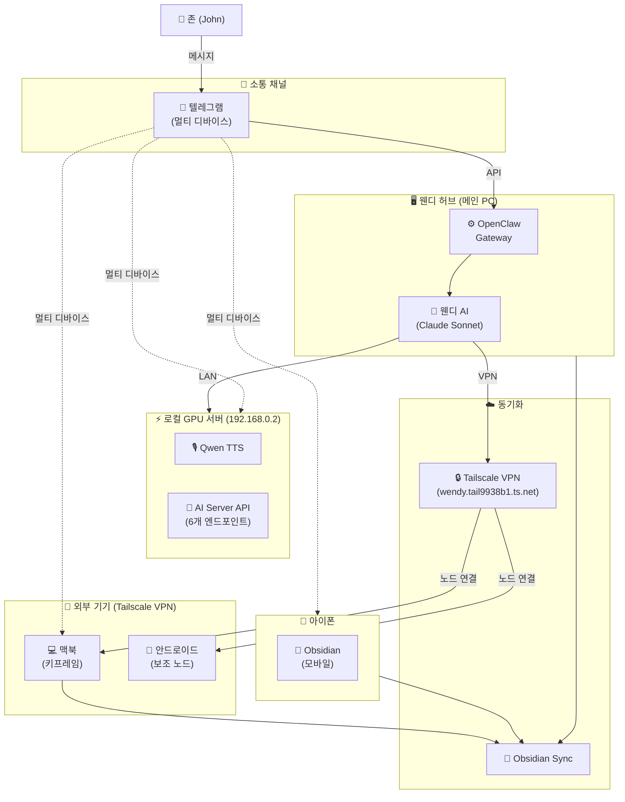

# 🌸 웬디 하드웨어 생태계 - 인프라 기술서

> 웬디(Wendy) AI 비서 생태계를 구성하는 하드웨어, 소프트웨어, 연결 구조 전체 문서

## 개요

웬디(Wendy)는 [[John]]의 개인 AI 비서 시스템으로, 여러 기기와 서비스가 유기적으로 연결된 분산 하드웨어 생태계 위에서 동작한다.

- **핵심 플랫폼**: OpenClaw (게이트웨이 + 노드 구조)
- **메인 허브**: 웬디 PC (집, 24/7 상시 가동)
- **주 대화 채널**: 텔레그램 (멀티 디바이스)
- **네트워킹**: Tailscale VPN + 로컬 LAN
- **메모 동기화**: Obsidian Sync (전 기기 통합)

존은 텔레그램으로 웬디와 대화하고, 웬디 PC가 명령을 처리한 뒤 필요에 따라 GPU 서버, 맥북, 안드로이드 노드 등으로 작업을 분산시킨다.

---

## 📊 전체 구조 다이어그램



---

## 🖥️ 기기별 상세 설명

### 1. 웬디 PC (메인 허브)

| 항목 | 내용 |
|------|------|
| **OS** | Windows 10 |
| **역할** | 생태계 중앙 허브, 모든 요청의 진입점 |
| **가동 방식** | 24/7 상시 켜져 있음 |
| **주요 소프트웨어** | OpenClaw Gateway, Obsidian, Tailscale, Watchdog |
| **네트워크** | 집 내 LAN + Tailscale VPN |

**역할 상세:**
- OpenClaw **게이트웨이** 실행 → 모든 노드(맥북, 안드로이드)를 중앙 관리
- 텔레그램 Bot API를 통해 존과 실시간 대화
- Watchdog (5분마다 Gateway 자동 재시작)
- 명령 처리 후 GPU 서버 / 각 노드로 작업 분산
- 옵시디언 볼트 동기화 (Obsidian Sync)

---

### 2. 192.168.0.2 GPU 서버

| 항목 | 내용 |
|------|------|
| **IP** | 192.168.0.2 (로컬 LAN 고정 IP) |
| **역할** | GPU 가속 AI 모델 실행, AI Server API 호스팅 |
| **주요 모델** | Qwen TTS, AI Server API (6개 엔드포인트) |
| **연결 방식** | 웬디 PC와 동일 집 LAN (직접 연결) |
| **접근 방법** | 웬디 PC → 로컬 LAN API 호출 |
| **상태** | ⚠️ AI Server API 추가 테스트 필요 |

**역할 상세:**
- 웬디 PC 단독으로 처리하기 무거운 AI 모델 전담
- **Qwen TTS**: 고품질 한국어 TTS 생성
- **AI Server API 6개 엔드포인트**: 포트별로 분리해 운영 중 (일부 미완료, 테스트 진행 중)
- 기타 AI 모델 API 호스팅
- 텔레그램 (멀티 디바이스) 설치됨
- Obsidian Sync 연동
- 외부 인터넷 없이 집 내부 LAN만으로 통신 (빠르고 프라이빗)
- **노드 연결**: 직접 API 호출 방식 (OpenClaw 노드 미연결)

---

### 3. 맥북 (키프레임)

| 항목 | 내용 |
|------|------|
| **별칭** | 키프레임 (Keyframe) |
| **노드 ID** | `b53a146cb5f3a4e05ca5d35abfe0d75bf6a645dc092288e2650fdd171a36c388` |
| **역할** | 존의 메인 작업 컴퓨터 + OpenClaw 노드 |
| **연결** | Tailscale VPN (`wendy.tail9938b1.ts.net:443`) |
| **허용 명령** | `/usr/bin/say` (macOS TTS만, 보안상 제한) |
| **상태** | ✅ 연결 완료 |

**역할 상세:**
- 존이 주로 사용하는 작업 기기
- OpenClaw **노드**로 연결되어 웬디가 원격 제어 가능
- **맥북 TTS**: `say` 명령으로 음성 출력 (속도 170)
- 텔레그램 (멀티 디바이스) 설치됨
- Obsidian Sync 연동
- ⚠️ TTS 외 다른 접근은 보안상 금지

---

### 4. 안드로이드 폰 (보조 노드)

| 항목 | 내용 |
|------|------|
| **역할** | 이동 중 보조 노드 + 웬디의 비서 |
| **환경** | Termux + proot Ubuntu (glibc) |
| **노드 ID** | `9473bc0aca3f78646da29790aedf16fa1a0e3019dfa863b57a45156a7246d013` |
| **연결** | Tailscale VPN (IP: 100.77.239.13) → 웬디 게이트웨이 |
| **실행 방식** | `/sdcard/run_fg.sh` → proot-distro login ubuntu → openclaw node run |
| **상태** | ✅ 연결 완료 + Termux:API 브릿지 완료 |

**역할 상세:**
- 존이 외출 중일 때도 OpenClaw 노드로 연결 유지
- `openclaw node run`으로 노드 실행 (proot Ubuntu 내부)
- Tailscale VPN으로 웬디 PC 게이트웨이와 보안 연결

**⚙️ 기술 구조 (koffi 문제 해결):**
- Termux 네이티브(Bionic libc)에서는 OpenClaw의 koffi 모듈 빌드 불가
- **해결**: proot Ubuntu(glibc)에서 OpenClaw 실행 + Termux:API 브릿지
- proot이 `/data/data/com.termux/files/usr/bin/`을 마운트 공유 → proot 안에서 Termux 바이너리 직접 호출 가능
- `/usr/local/bin/termux-*`에 브릿지 스크립트 40개 설치 → 자연스러운 명령어 호출

**📱 Termux:API로 제어 가능한 기능:**
| 기능 | 명령어 | 상태 |
|------|--------|------|
| 배터리 상태 | `termux-battery-status` | ✅ 확인됨 |
| 와이파이 정보 | `termux-wifi-connectioninfo` | ✅ 확인됨 |
| 토스트 알림 | `termux-toast` | ✅ 확인됨 |
| 카메라 촬영 | `termux-camera-photo` | ✅ 설치됨 |
| GPS 위치 | `termux-location` | ✅ 설치됨 |
| TTS 음성 | `termux-tts-speak` | ✅ 설치됨 |
| 클립보드 | `termux-clipboard-get/set` | ✅ 설치됨 |
| 손전등 | `termux-torch` | ✅ 설치됨 |
| 볼륨 조절 | `termux-volume` | ✅ 설치됨 |
| 알림 보내기 | `termux-notification` | ✅ 설치됨 |
| SMS 읽기 | `termux-sms-inbox` | ✅ 설치됨 |
| 진동 | `termux-vibrate` | ✅ 설치됨 |
| 센서 데이터 | `termux-sensor` | ✅ 설치됨 |

**🔐 allowlist 등록 패턴:**
- `/usr/local/bin/termux-*`
- `/data/data/com.termux/files/usr/bin/termux-*`
- `/data/data/com.termux/files/usr/bin/bash`
- `/usr/bin/which`, `/usr/bin/uname`, `/system/bin/am`

---

### 5. 아이폰

| 항목 | 내용 |
|------|------|
| **역할** | 모바일 메모 접근 |
| **주요 앱** | Obsidian (모바일), 텔레그램 |
| **동기화** | Obsidian Sync (유료) |
| **상태** | ✅ 동기화 완료 |

**역할 상세:**
- Obsidian 모바일 앱으로 존의 메모를 이동 중에도 열람/편집
- Obsidian Sync로 전 기기 볼트와 실시간 양방향 동기화
- 텔레그램 (멀티 디바이스) 설치됨
- ❌ iCloud 미사용 (Obsidian Sync 전용)

---

## 📡 소통 채널

### 텔레그램 (메인 채널)

- **설치 기기**: 웬디 PC, 맥북, 아이폰, 안드로이드, 102서버 PC
- **역할**: 존↔웬디 주요 대화, 멀티 디바이스 동기화
- **특징**: 어느 기기에서든 웬디와 대화 가능
- **멀티 디바이스**: 단일 계정으로 5개 기기에서 동시 연결

### 옵시디언 (메모 채널)

- **동기화 방식**: Obsidian Sync (유료 구독)
- **동기화 기기**: 웬디 PC, 맥북, 아이폰, 102서버
- **역할**: 웬디 메모리 파일, 존의 노트 전기기 공유
- **볼트 경로**: `C:\Users\phase\Documents\Obsidian\John's Brain\`

---


## 🍎 애플 에코시스템 - 시리/단축어 연동

웬디는 애플 단축어(Shortcuts)를 통해 시리(Siri)로 어느 애플 기기에서든 호출 가능하다.

### 지원 기기
| 기기 | 호출 방법 | 상태 |
|------|----------|------|
| 아이폰 | 시리야, 웬디 → 단축어 실행 | ✅ 사용 가능 |
| 맥북 | Hey Siri, 웬디 → 단축어 실행 | ✅ 사용 가능 |
| 애플워치 | 손목에서 시리 호출 → 단축어 실행 | ✅ 사용 가능 |

### 동작 방식
음성 호출 → 애플 단축어 실행 → 텔레그램 API → 웬디 AI 응답 → 텔레그램 알림

### 특징
- 아이폰 / 맥북 / 애플워치 **3기기 전부** 지원
- 핸즈프리로 웬디 호출 가능
- 이동 중 / 운동 중 / 손이 바쁠 때도 웬디와 대화
- 단축어 앱에서 커스텀 명령어 자유롭게 설정 가능

### ⚙️ 단축어 세팅 방법 (실제 구현)

> 2026-02-07 세팅 완료 — 아이폰에서 Siri로 웬디 호출 성공!

**애플 단축어 앱 → "웬디 호출" 단축어 생성**

| 항목 | 값 |
|------|-----|
| **URL** | `https://wendy.tail9938b1.ts.net/v1/chat/completions?agent=siri` |
| **Method** | POST |
| **Header** | `Authorization: Bearer {gateway_token}` |
| **Header** | `Content-Type: application/json` |

**Body (JSON):**
```json
{
  "model": "claude-3-5-haiku-latest",
  "messages": [{"role": "user", "content": "질문내용"}],
  "user": "siri:john"
}
```

**에이전트 설정:**
- **siri 에이전트** — Haiku 모델 (빠른 응답 최적화)
- **필수 조건**: iPhone에 Tailscale 설치 및 연결 상태여야 함
- **적용 기기**: 아이폰 / 맥북 / 애플워치 (같은 단축어 공유 가능)


## 🔒 노드 권한 구조

### 현재 권한

| 노드 | 현재 허용 | 비고 |
|------|----------|------|
| 맥북 | TTS만 (`/usr/bin/say`) | 보안상 최소 권한 |
| 안드로이드 | Termux:API 전체 (40개 명령) | ✅ 브릿지 + allowlist 완료 |
| 102서버 | 직접 API 호출만 | 노드 미연결, API 방식 |

---

## 데이터 흐름

### 기본 대화 흐름
```
존 (텔레그램 메시지)
  → 텔레그램 Bot API
    → 웬디 PC (OpenClaw Gateway)
      → 응답 생성 (Claude API 또는 로컬 모델)
        → 텔레그램 → 존
```

### TTS 요청 흐름 (Qwen TTS)
```
존 (음성 요청)
  → 웬디 PC
    → 192.168.0.2 GPU 서버 (Qwen TTS)
      → 음성 파일 생성
        → 웬디 PC → 텔레그램 → 존
```

### 맥북 TTS 흐름
```
존 ("맥북으로 말해줘")
  → 웬디 PC (OpenClaw Gateway)
    → Tailscale VPN
      → 맥북 노드 (say 명령)
        → 맥북 스피커에서 음성 출력
```

### 안드로이드 노드 제어 흐름
```
웬디 AI (nodes.run)
  → OpenClaw Gateway
    → Tailscale VPN
      → 안드로이드 proot Ubuntu (OpenClaw 노드)
        → 브릿지 스크립트 (/usr/local/bin/termux-*)
          → Termux:API (/data/data/com.termux/files/usr/bin/termux-*)
            → 안드로이드 하드웨어 (카메라, GPS, 스피커 등)
```

### 메모 동기화 흐름
```
아이폰 / 맥북 (Obsidian 편집)
  → Obsidian Sync (클라우드)
    → 웬디 PC 옵시디언 볼트
      ↔ 웬디가 읽기/쓰기 가능
```

---

## 현재 연결 상태

| 기기/서비스               | 상태                   | 비고                         |
| -------------------- | -------------------- | -------------------------- |
| 웬디 PC                | ✅ 가동 중               | 24/7 메인 허브                 |
| GPU 서버 (192.168.0.2) | ⚠️ 부분 운용             | Qwen TTS OK / AI API 테스트 중 |
| 맥북 (키프레임)            | ✅ 노드 연결됨             | Tailscale 활성화, TTS만 허용     |
| 안드로이드                | ✅ 노드 연결 + API 브릿지 완료 | Termux:API 40개 명령 사용 가능    |
| 아이폰                  | ✅ 동기화 중              | Obsidian Sync 운용           |
| Tailscale VPN        | ✅ 활성화                | wendy.tail9938b1.ts.net    |
| 텔레그램 Bot             | ✅ 운용 중               | 멀티 디바이스 5개 기기              |
| Obsidian Sync        | ✅ 운용 중               | 유료 구독, 전 기기 동기화            |

---

## ⚠️ 현재 문제점

### 1. AI 모델별 페르소나 불일치

- **증상**: Claude, GPT, Gemini 등 모델마다 초기 세팅/메모리 불러오기 방식이 달라 오리지널 웬디 재현 어려움
- **원인**: 각 모델의 컨텍스트 처리 방식 차이
- **해결 방향**: 통일된 프롬프트 체계 + 모델별 어댑터 개발

### 2. AI 모델 연결 부족

- **원인**: 업데이트 오류로 일부 연결 소실
- **미연결 모델**:
  - GitHub Copilot
  - Google AI (Gemini)
  - Z.ai
  - GLM (智谱AI)

### 3. GPU 서버 AI API 미완료

- **현황**: AI Server API 6개 엔드포인트 중 일부 테스트 미완료
- **영향**: 일부 AI 모델 API 불안정

---

## 🗺️ 향후 로드맵

### 단기 (이번 달)

- [ ] AI Server API 6개 테스트 완료
- [x] 안드로이드 노드 연결 완료 ✅ (2026-02-20, Termux:API 브릿지 포함)
- [ ] 소실된 AI 모델 재연결 (Copilot, Google, Z.ai, GLM)

### 중기 (3개월)

- [ ] 사용 가능한 모든 AI 모델 활성화
- [ ] 웬디 페르소나 통일 (모든 모델에서 동일한 웬디 구현)
- [x] 노드 권한 확장 (카메라, 센서, 음성 등) ✅ (안드로이드 Termux:API 40개 완료)
- [ ] GPU 서버 고가용성 (Fallback 처리)
- [ ] 모니터링 대시보드 구축

### 장기 (6개월+)

- [ ] **Local LLM 전환** — 외부 API 의존도 줄이기
- [ ] 자체 GPU 서버에서 웬디 전용 모델 운영
- [ ] 완전한 자급자족 AI 생태계 구축
- [ ] 집 자동화 (스마트홈) 연동
- [ ] 백업 전략 완비 (옵시디언 볼트 + 웬디 메모리 정기 백업)

---

## 🔗 관련 문서

- [[웬디 (Wendy)]]
- [[SOUL.md]] - 웬디 정체성
- [[TOOLS.md]] - 도구 상세 설정
- [[OpenClaw]]
- [[Obsidian 사용법]]
- [[Tailscale 설정]]
- [[John]]

---

*마지막 업데이트: 2026-02-20 18:40 (Termux:API 브릿지 완료 반영)*
*작성: 웬디 🌸*
