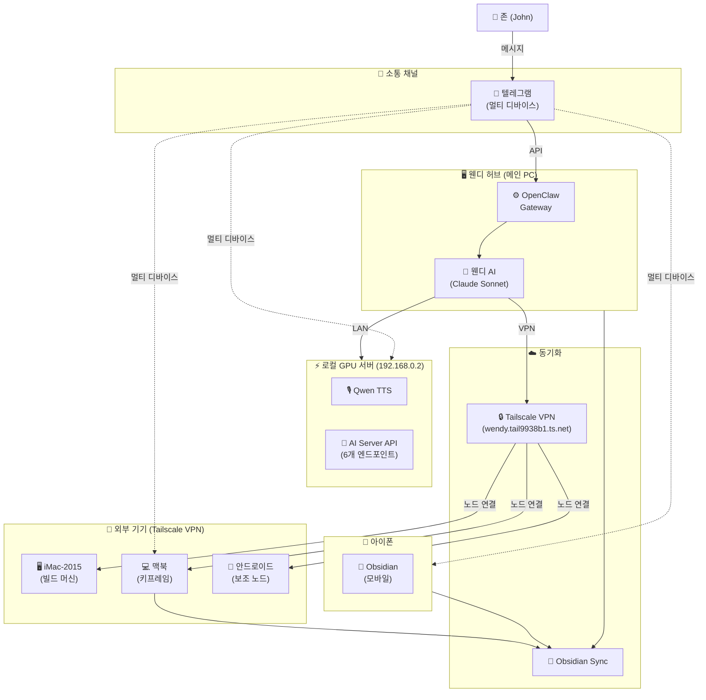

# 🌸 웬디 하드웨어 생태계 - 인프라 기술서

> 웬디(Wendy) AI 비서 생태계를 구성하는 하드웨어, 소프트웨어, 연결 구조 전체 문서

## 개요

웬디(Wendy)는 [[John]]의 개인 AI 비서 시스템으로, 여러 기기와 서비스가 유기적으로 연결된 분산 하드웨어 생태계 위에서 동작한다.

- **핵심 플랫폼**: OpenClaw (게이트웨이 + 노드 구조)
- **메인 허브**: 웬디 PC (집, 24/7 상시 가동)
- **주 대화 채널**: 텔레그램 (멀티 디바이스)
- **네트워킹**: Tailscale VPN + 로컬 LAN
- **메모 동기화**: Obsidian Sync (전 기기 통합)

존은 텔레그램으로 웬디와 대화하고, 웬디 PC가 명령을 처리한 뒤 필요에 따라 GPU 서버, 맥북, 안드로이드 노드 등으로 작업을 분산시킨다.

---

## 📊 전체 구조 다이어그램


```mermaid
graph TD
    존["👤 존 (John)"]

    subgraph 소통채널["📡 소통 채널"]
        텔레그램["📱 텔레그램\n(멀티 디바이스)"]
    end

    subgraph 웬디허브["🖥️ 웬디 허브 (메인 PC)"]
        OpenClaw["⚙️ OpenClaw\nGateway"]
        웬디AI["🌸 웬디 AI\n(Claude Sonnet)"]
    end

    subgraph 로컬서버["⚡ 로컬 GPU 서버 (192.168.0.2)"]
        QwenTTS["🎙️ Qwen TTS"]
        AIAPI["🤖 AI Server API\n(6개 엔드포인트)"]
    end

    subgraph 외부기기["📱 외부 기기 (Tailscale VPN)"]
        iMac["🖥️ iMac-2015\n(빌드 머신)"]
        맥북["💻 맥북\n(키프레임)"]
        안드로이드["📱 안드로이드\n(보조 노드)"]
    end

    subgraph 아이폰["🍎 아이폰"]
        옵시디언모바일["📓 Obsidian\n(모바일)"]
    end

    subgraph 동기화["☁️ 동기화"]
        ObsidianSync["📓 Obsidian Sync"]
        Tailscale["🔒 Tailscale VPN\n(wendy.tail9938b1.ts.net)"]
    end

    존 -->|메시지| 텔레그램
    텔레그램 -->|API| OpenClaw
    OpenClaw --> 웬디AI
    웬디AI -->|LAN| 로컬서버
    웬디AI -->|VPN| Tailscale
    Tailscale -->|노드 연결| iMac
    Tailscale -->|노드 연결| 맥북
    Tailscale -->|노드 연결| 안드로이드
    아이폰 --> ObsidianSync
    웬디허브 --> ObsidianSync
    맥북 --> ObsidianSync
    텔레그램 -.->|멀티 디바이스| 맥북
    텔레그램 -.->|멀티 디바이스| 아이폰
    텔레그램 -.->|멀티 디바이스| 로컬서버
```

---

## 🖥️ 기기별 상세 설명

### 1. 웬디 PC (메인 허브)

| 항목 | 내용 |
|------|------|
| **OS** | Windows 10 |
| **역할** | 생태계 중앙 허브, 모든 요청의 진입점 |
| **가동 방식** | 24/7 상시 켜져 있음 |
| **주요 소프트웨어** | OpenClaw Gateway, Obsidian, Tailscale, Watchdog |
| **네트워크** | 집 내 LAN + Tailscale VPN |

**역할 상세:**
- OpenClaw **게이트웨이** 실행 → 모든 노드(맥북, 안드로이드)를 중앙 관리
- 텔레그램 Bot API를 통해 존과 실시간 대화
- Watchdog (5분마다 Gateway 자동 재시작)
- 명령 처리 후 GPU 서버 / 각 노드로 작업 분산
- 옵시디언 볼트 동기화 (Obsidian Sync)

---

### 2. 192.168.0.2 GPU 서버

| 항목              | 내용                                               |
| --------------- | ------------------------------------------------ |
| **IP**          | 192.168.0.2 (로컬 LAN) / Tailscale: 100.116.162.52 |
| **역할**          | GPU 가속 AI 모델 실행, AI Server API 호스팅               |
| **주요 모델**       | Qwen TTS, AI Server API (8개 엔드포인트)               |
| **연결 방식**       | 웬디 PC와 동일 집 LAN + Tailscale VPN                  |
| **접근 URL**      | `http://100.116.162.52:8100` (Tailscale 경유)      |
| **OpenClaw 노드** | ✅ 연결됨 (display-name: AI-Server)                  |
| **상태**          | ✅ 운용 중 (8개 중 6개 작동)                              |

**역할 상세:**
- 웬디 PC 단독으로 처리하기 무거운 AI 모델 전담
- **Qwen TTS**: 고품질 한국어 TTS 생성 (Gradio, 포트 7860)
- **AI Server API** (FastAPI, 포트 8100): 8개 엔드포인트 운영
- 텔레그램 (멀티 디바이스) 설치됨
- Obsidian Sync 연동
- **노드 연결**: ✅ OpenClaw 노드 연결 완료 + Tailscale 경유 직접 API 호출 병행

**AI Server API 엔드포인트 현황 (2026-02-22 테스트):**

| 엔드포인트                    | 기능                        | 상태   | 응답시간                 |
| ------------------------ | ------------------------- | ---- | -------------------- |
| `GET /api/health`        | 서버 상태                     | ✅    | 0.07s                |
| `GET /api/gpu`           | GPU 메모리                   | ✅    | 4.3s                 |
| `POST /api/stt`          | 음성→텍스트 (Whisper large-v3) | ✅    | ~42s                 |
| `POST /api/remove-bg`    | 배경 제거                     | ✅    | ~7s                  |
| `POST /api/detect`       | 객체 탐지 (YOLOv11)           | ✅    | ~5sㅐ                 |
| `POST /api/upscale`      | 이미지 업스케일 (Real-ESRGAN)    | ✅    | ~7s                  |
| `POST /api/ocr`          | OCR                       | ❌ 버그 | `use_gpu` 인수 오류      |
| `POST /api/face-analyze` | 얼굴 분석                     | ❌ 버그 | `allowed_modules` 오류 |

> 접근 URL: `http://100.116.162.52:8100` (Tailscale)  
> 소스코드: `C:\JohnCodeQ\ai-server-api\` (AI-Server PC)

---

### 3. iMac-2015 (빌드 머신) — 신규 추가 2026-02-25

| 항목 | 내용 |
|------|------|
| **모델** | iMac Retina 5K 27-inch Late 2015 (iMac17,1) |
| **CPU** | Intel Core i5 3.2GHz |
| **RAM** | 32GB DDR3 |
| **GPU** | AMD Radeon R9 M390 2GB |
| **OS** | macOS Sonoma 14 (OCLP 2.4.1 패치) |
| **Tailscale IP** | 100.93.192.36 |
| **노드 ID** | `075363f6bbc0459d30de0c850816656503b34f6d704d68616c64d23b485f0d91` |
| **연결 상태** | ✅ connected |

**역할 상세:**
- iOS 앱 빌드 전용 머신 (Xcode 16 + Flutter)
- Android 빌드 보조
- 개발 환경: CocoaPods, Flutter, Java/JDK

**허용 명령어:**
- `xcodebuild`, `git`, `bash`, `zsh`, `env`, `flutter`, `pod`, `say` (TTS)

**노드 설치 방법:**
```bash
openclaw node install --host wendy.tail9938b1.ts.net --port 443 --tls
```

> OCLP(OpenCore Legacy Patcher) 2.4.1로 지원 종료된 iMac17,1에 macOS Sonoma 14 설치 완료

---

### 4. 맥북 (키프레임)

| 항목 | 내용 |
|------|------|
| **별칭** | 키프레임 (Keyframe) |
| **노드 ID** | `b53a146cb5f3a4e05ca5d35abfe0d75bf6a645dc092288e2650fdd171a36c388` |
| **역할** | 존의 메인 작업 컴퓨터 + OpenClaw 노드 |
| **연결** | Tailscale VPN (`wendy.tail9938b1.ts.net:443`) |
| **허용 명령** | `/usr/bin/say` (macOS TTS만, 보안상 제한) |
| **상태** | ✅ 연결 완료 |

**역할 상세:**
- 존이 주로 사용하는 작업 기기
- OpenClaw **노드**로 연결되어 웬디가 원격 제어 가능
- **맥북 TTS**: `say` 명령으로 음성 출력 (속도 170)
- 텔레그램 (멀티 디바이스) 설치됨
- Obsidian Sync 연동
- ⚠️ TTS 외 다른 접근은 보안상 금지

---

### 5. 안드로이드 폰 (보조 노드)

| 항목 | 내용 |
|------|------|
| **역할** | 이동 중 보조 노드 + 웬디의 비서 |
| **환경** | Termux + proot Ubuntu (glibc) |
| **노드 ID** | `9473bc0aca3f78646da29790aedf16fa1a0e3019dfa863b57a45156a7246d013` |
| **연결** | Tailscale VPN (IP: 100.77.239.13) → 웬디 게이트웨이 |
| **실행 방식** | `/sdcard/run_fg.sh` → proot-distro login ubuntu → openclaw node run |
| **상태** | ✅ 연결 완료 + Termux:API 브릿지 완료 |

**역할 상세:**
- 존이 외출 중일 때도 OpenClaw 노드로 연결 유지
- `openclaw node run`으로 노드 실행 (proot Ubuntu 내부)
- Tailscale VPN으로 웬디 PC 게이트웨이와 보안 연결

**⚙️ 기술 구조 (koffi 문제 해결):**
- Termux 네이티브(Bionic libc)에서는 OpenClaw의 koffi 모듈 빌드 불가
- **해결**: proot Ubuntu(glibc)에서 OpenClaw 실행 + Termux:API 브릿지
- proot이 `/data/data/com.termux/files/usr/bin/`을 마운트 공유 → proot 안에서 Termux 바이너리 직접 호출 가능
- `/usr/local/bin/termux-*`에 브릿지 스크립트 40개 설치 → 자연스러운 명령어 호출

**📱 Termux:API로 제어 가능한 기능:**
| 기능 | 명령어 | 상태 |
|------|--------|------|
| 배터리 상태 | `termux-battery-status` | ✅ 확인됨 |
| 와이파이 정보 | `termux-wifi-connectioninfo` | ✅ 확인됨 |
| 토스트 알림 | `termux-toast` | ✅ 확인됨 |
| 카메라 촬영 | `termux-camera-photo` | ✅ 설치됨 |
| GPS 위치 | `termux-location` | ✅ 설치됨 |
| TTS 음성 | `termux-tts-speak` | ✅ 설치됨 |
| 클립보드 | `termux-clipboard-get/set` | ✅ 설치됨 |
| 손전등 | `termux-torch` | ✅ 설치됨 |
| 볼륨 조절 | `termux-volume` | ✅ 설치됨 |
| 알림 보내기 | `termux-notification` | ✅ 설치됨 |
| SMS 읽기 | `termux-sms-inbox` | ✅ 설치됨 |
| 진동 | `termux-vibrate` | ✅ 설치됨 |
| 센서 데이터 | `termux-sensor` | ✅ 설치됨 |

**🔐 allowlist 등록 패턴:**
- `/usr/local/bin/termux-*`
- `/data/data/com.termux/files/usr/bin/termux-*`
- `/data/data/com.termux/files/usr/bin/bash`
- `/usr/bin/which`, `/usr/bin/uname`, `/system/bin/am`

---

### 6. 아이폰 (iPhone 12 Pro)

| 항목 | 내용 |
|------|------|
| **역할** | 모바일 노드 + 메모 접근 |
| **주요 앱** | OpenClaw iOS, Obsidian, 텔레그램, Tailscale |
| **노드 ID** | `3c646b9e25596c97ed9b3bbb1077461151c018c6fbdeec123b16d38980b11397` |
| **Tailscale IP** | `100.98.77.73` |
| **동기화** | Obsidian Sync (유료) |
| **상태** | ✅ OpenClaw 노드 연결 완료 (2026-02-21) |

**역할 상세:**
- Obsidian 모바일 앱으로 존의 메모를 이동 중에도 열람/편집
- **OpenClaw iOS 앱** (Xcode 직접 빌드) → 노드로 연결
- Tailscale VPN으로 웬디 PC 게이트웨이와 보안 연결
- ❌ iCloud 미사용 (Obsidian Sync 전용)

**iOS 노드 지원 기능:**

| 기능 | 지원 | 비고 |
|------|------|------|
| 알림 전송 | ✅ | 백그라운드 OK |
| TTS 음성 | ✅ | 포그라운드 필요, Yuna (ko-KR) |
| 카메라 캡처 | ✅ | 포그라운드 필요 |
| 화면 캡처 | ✅ | 포그라운드 필요 |
| 캘린더 조회 | ✅ | |
| 연락처 검색 | ✅ | |
| 위치 정보 | ⚠️ | 권한 설정 필요 |
| Voice Wake | ⚠️ | 마이크 권한 필요 |
| Apple Watch | ⚠️ | 워치 앱 별도 설치 필요 |

> 설치 방법: [[OpenClaw iOS Node 설치 가이드]]

---

## 📡 소통 채널

### 텔레그램 (메인 채널)

- **설치 기기**: 웬디 PC, 맥북, 아이폰, 안드로이드, 102서버 PC
- **역할**: 존↔웬디 주요 대화, 멀티 디바이스 동기화
- **특징**: 어느 기기에서든 웬디와 대화 가능
- **멀티 디바이스**: 단일 계정으로 5개 기기에서 동시 연결

### 옵시디언 (메모 채널)

- **동기화 방식**: Obsidian Sync (유료 구독)
- **동기화 기기**: 웬디 PC, 맥북, 아이폰, AI서버 PC
- **역할**: 웬디 메모리 파일, 존의 노트 전기기 공유
- **볼트 경로**: `C:\Users\phase\Documents\Obsidian\John's Brain\`

### 셀리(Sally) 봇 (존+서머 공유 AI 비서) — 2026-02-21 추가

- **봇**: @Sally_summer_bot
- **에이전트 ID**: `group`
- **워크스페이스**: `C:\Users\phase\clawd-group\`
- **목적**: 존+서머(아내) 공유 AI 비서 (웬디와 완전 분리)
- **그룹채팅 ID**: -5261274927

| 항목 | 웬디 | 셀리 |
|------|------|------|
| 에이전트 | main | group |
| 워크스페이스 | clawd/ | clawd-group/ |
| 허용 대상 | 존만 | 존 + 서머 |
| 서머 권한 | ❌ | ✅ 메모리 관리자 |

### Quartz 퍼블리싱 — 2026-02-21 추가

- **목적**: 옵시디언 노트 선택적 웹 공개 (`publish: true` 노트만)
- **레포**: `keyfream7001/john-brain` (GitHub Pages)
- **URL**: https://keyfream7001.github.io/john-brain/
- **동기화 스크립트**: `C:\JohnCodeQ\obsidian-quartz\sync-obsidian.ps1`

---


## 🍎 애플 에코시스템 - 시리/단축어 연동

웬디는 애플 단축어(Shortcuts)를 통해 시리(Siri)로 어느 애플 기기에서든 호출 가능하다.

### 지원 기기
| 기기 | 호출 방법 | 상태 |
|------|----------|------|
| 아이폰 | 시리야, 웬디 → 단축어 실행 | ✅ 사용 가능 |
| 맥북 | Hey Siri, 웬디 → 단축어 실행 | ✅ 사용 가능 |
| 애플워치 | 손목에서 시리 호출 → 단축어 실행 | ✅ 사용 가능 |

### 동작 방식
음성 호출 → 애플 단축어 실행 → 텔레그램 API → 웬디 AI 응답 → 텔레그램 알림

### 특징
- 아이폰 / 맥북 / 애플워치 **3기기 전부** 지원
- 핸즈프리로 웬디 호출 가능
- 이동 중 / 운동 중 / 손이 바쁠 때도 웬디와 대화
- 단축어 앱에서 커스텀 명령어 자유롭게 설정 가능

### ⚙️ 단축어 세팅 방법 (실제 구현)

> 2026-02-07 세팅 완료 — 아이폰에서 Siri로 웬디 호출 성공!

**애플 단축어 앱 → "웬디 호출" 단축어 생성**

| 항목 | 값 |
|------|-----|
| **URL** | `https://wendy.tail9938b1.ts.net/v1/chat/completions?agent=siri` |
| **Method** | POST |
| **Header** | `Authorization: Bearer {gateway_token}` |
| **Header** | `Content-Type: application/json` |

**Body (JSON):**
```json
{
  "model": "claude-3-5-haiku-latest",
  "messages": [{"role": "user", "content": "질문내용"}],
  "user": "siri:john"
}
```

**에이전트 설정:**
- **siri 에이전트** — Haiku 모델 (빠른 응답 최적화)
- **필수 조건**: iPhone에 Tailscale 설치 및 연결 상태여야 함
- **적용 기기**: 아이폰 / 맥북 / 애플워치 (같은 단축어 공유 가능)


## 🔒 노드 권한 구조

### 현재 권한

| 노드 | 현재 허용 | 비고 |
|------|----------|------|
| iMac-2015 | xcodebuild, git, bash, zsh, env, flutter, pod, say | ✅ 빌드 머신 전용 (2026-02-25 추가) |
| 맥북 | TTS만 (`/usr/bin/say`) | 보안상 최소 권한 |
| 안드로이드 | Termux:API 전체 (40개 명령) | ✅ 브릿지 + allowlist 완료 |
| AI-Server | 직접 API 호출만 | 노드 미연결, API 방식 |

---

## 데이터 흐름

### 기본 대화 흐름
```
존 (텔레그램 메시지)
  → 텔레그램 Bot API
    → 웬디 PC (OpenClaw Gateway)
      → 응답 생성 (Claude API 또는 로컬 모델)
        → 텔레그램 → 존
```

### TTS 요청 흐름 (Qwen TTS)
```
존 (음성 요청)
  → 웬디 PC
    → 192.168.0.2 GPU 서버 (Qwen TTS)
      → 음성 파일 생성
        → 웬디 PC → 텔레그램 → 존
```

### 맥북 TTS 흐름
```
존 ("맥북으로 말해줘")
  → 웬디 PC (OpenClaw Gateway)
    → Tailscale VPN
      → 맥북 노드 (say 명령)
        → 맥북 스피커에서 음성 출력
```

### 안드로이드 노드 제어 흐름
```
웬디 AI (nodes.run)
  → OpenClaw Gateway
    → Tailscale VPN
      → 안드로이드 proot Ubuntu (OpenClaw 노드)
        → 브릿지 스크립트 (/usr/local/bin/termux-*)
          → Termux:API (/data/data/com.termux/files/usr/bin/termux-*)
            → 안드로이드 하드웨어 (카메라, GPS, 스피커 등)
```

### 메모 동기화 흐름
```
아이폰 / 맥북 (Obsidian 편집)
  → Obsidian Sync (클라우드)
    → 웬디 PC 옵시디언 볼트
      ↔ 웬디가 읽기/쓰기 가능
```

---

## 현재 연결 상태

| 기기/서비스               | Tailscale IP | 상태                   | 비고                         |
| -------------------- | ------------ | -------------------- | -------------------------- |
| 웬디 PC (Wendy)        | 100.124.46.21 | ✅ 가동 중               | 24/7 메인 허브, 게이트웨이          |
| iMac-2015            | 100.93.192.36 | ✅ 노드 연결됨 (2026-02-25) | iOS/Android 빌드 머신, OCLP Sonoma 14 |
| GPU 서버 (AI-Server)   | 100.116.162.52 | ❌ 오프라인 (필요시 수동)  | Qwen TTS, AI API (6/8 작동) |
| 맥북 (키프레임)            | 100.90.163.70 | ✅ 노드 연결됨             | TTS만 허용 (`/usr/bin/say`) |
| 아이폰 (iPhone 12 Pro)  | 100.98.77.73  | ❌ 오프라인              | OpenClaw iOS + Tailscale    |
| 안드로이드 (Termux)       | 100.77.239.13 | ❌ 오프라인              | Termux:API 40개 명령 사용 가능  |
| Tailscale VPN        | —             | ✅ 활성화                | wendy.tail9938b1.ts.net    |
| 텔레그램 Bot             | —             | ✅ 운용 중               | 멀티 디바이스 연결                 |
| Obsidian Sync        | —             | ✅ 운용 중               | 유료 구독, 전 기기 동기화            |

---

## ⚠️ 현재 문제점

### 1. AI 모델별 페르소나 불일치

- **증상**: Claude → Gemini/GPT 등으로 바꾸면 SOUL.md·MEMORY.md를 제대로 인식 못함
- **원인**: OpenClaw가 Claude 최적화 + 모델마다 system prompt 처리 방식 다름
- **진행 상황**: openclaw.json 최적화 적용 완료 (2026-02-22) → 개선됨
  - `reserveTokensFloor` 4k → 20k
  - `memorySearch.remote.batch.enabled: false`
  - `tools.web.fetch.maxChars: 30000`
- **전략 문서**: [[⭐ 웬디 AI 모델 페르소나 통일 전략]]

### 2. AI 모델 연결 부족 (일부 복구 필요)

- **원인**: 2026.2.x 업데이트 오류로 일부 연결 소실
- **복구 필요 모델**:
  - [ ] GitHub Copilot
  - [ ] Google AI (Gemini) ← 직접 연결 (현재 API Key는 있음)
  - [ ] Z.ai
  - [ ] GLM (智谱AI)

### 3. AI Server API 버그 (수정 필요)

- **현황**: 8개 엔드포인트 중 6개 작동, 2개 버그
- **버그 1**: `/api/ocr` — `ocr_worker.py`의 `use_gpu` 인수 제거 필요
- **버그 2**: `/api/face-analyze` — `face_worker.py`의 `allowed_modules` 인수 제거 필요
- **영향**: OCR, 얼굴 분석 기능 사용 불가

### 4. 게이트웨이 재시작 문제 (와치독 미설치)

- **증상**: Ctrl+C 후 재시작 시 기존 프로세스가 포트 점유 → 충돌 또는 재시작 실패
- **현재 해결법**: PID 직접 종료 후 재시작 (웬디가 수동으로 처리 가능)
- **근본 해결**: Windows 작업 스케줄러 와치독 설정 필요 → 월요일(2/23) 예정

### 5. 맥북 TTS 서비스 모드 타임아웃

- **증상**: LaunchAgent 서비스 모드에서 `say` 명령 타임아웃 발생
- **수동 실행**은 정상 작동
- **원인 추정**: 서비스 모드에서 게이트웨이 토큰 누락

### 6. Cerebras 8B 모델 400 오류

- **증상**: `cerebras/llama3.1-8b` 사용 시 400 오류 발생
- **원인**: OpenClaw가 모든 모델에 `thinking=low` 파라미터 전달 → Cerebras 8B가 이를 처리 못함
- **현재 해결법**: `cerebras70b` (120B) 사용 또는 `/thinking off` 후 전환
- **근본 해결**: OpenClaw per-model thinking 비활성화 기능 미구현 → GitHub 이슈 제출 완료
- **참고**: [[⭐ OpenClaw Cerebras 및 호환성 분석]]

---

## 🗺️ 향후 로드맵

### 단기 (이번 달)

- [x] AI Server API 테스트 완료 ✅ (2026-02-22 — 6/8 작동, OCR·face 버그 식별)
- [x] 안드로이드 노드 연결 완료 ✅ (2026-02-20, Termux:API 브릿지 포함)
- [x] Gemini 최적화 openclaw.json 설정 완료 ✅ (2026-02-22)
- [x] iMac-2015 OpenClaw 노드 연결 완료 ✅ (2026-02-25, OCLP Sonoma 14, 빌드 머신)
- [ ] AI Server OCR/face 버그 수정 (코드 2줄 수정)
- [ ] 소실된 AI 모델 재연결 (Copilot, Google, Z.ai, GLM)
- [ ] 게이트웨이 와치독 설정 (Windows 작업 스케줄러, 2/23 예정)

### 중기 (3개월)

- [ ] 사용 가능한 모든 AI 모델 활성화
- [ ] 웬디 페르소나 통일 (모든 모델에서 동일한 웬디 구현)
- [x] 노드 권한 확장 (카메라, 센서, 음성 등) ✅ (안드로이드 Termux:API 40개 완료)
- [ ] GPU 서버 고가용성 (Fallback 처리)
- [ ] 모니터링 대시보드 구축

### 장기 (6개월+)

- [ ] **Local LLM 전환** — 외부 API 의존도 줄이기
- [ ] 자체 GPU 서버에서 웬디 전용 모델 운영
- [ ] 완전한 자급자족 AI 생태계 구축
- [ ] 집 자동화 (스마트홈) 연동
- [ ] 백업 전략 완비 (옵시디언 볼트 + 웬디 메모리 정기 백업)

---

## 🔗 관련 문서

- [[웬디 (Wendy)]]
- [[SOUL.md]] - 웬디 정체성
- [[TOOLS.md]] - 도구 상세 설정
- [[OpenClaw]]
- [[OpenClaw iOS Node 설치 가이드]]
- [[⭐ 웬디 AI 모델 페르소나 통일 전략]]
- [[⭐ OpenClaw Gemini 연동 완전 가이드]]
- [[⭐ OpenClaw Cerebras 및 호환성 분석]]
- [[Quartz 퍼블리싱 가이드]]
- [[셀리(Sally) 텔레그램 멀티에이전트 설정 가이드]]
- [[Obsidian 사용법]]
- [[Tailscale 설정]]
- [[John]]

---

*마지막 업데이트: 2026-02-25 — iMac-2015 신규 노드 추가 (OCLP Sonoma 14, OpenClaw 노드 연결, iOS/Android 빌드 머신), 노드 현황 테이블 Tailscale IP 추가*
*이전 업데이트: 2026-02-22 — AI Server API 테스트 결과, 셀리 봇, Quartz, iOS 노드 연결, Cerebras 분석, 게이트웨이 재시작 문제, openclaw.json 최적화 반영*
*작성: 웬디 🌸*
