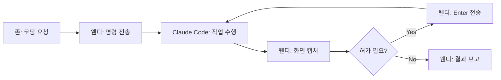

# 웬디-Claude Code 연동 가이드

## 개요
웬디(Clawdbot)가 WSL Ubuntu의 tmux에서 실행 중인 Claude Code를 직접 제어하는 방법.
존이 코딩 요청 → 웬디가 Claude Code에 작업 지시 → 결과 확인 후 보고

---

## 환경 구성

### 필수 설치
- **WSL**: Ubuntu (사용자: wendy)
- **Node.js**: v22+ (Ubuntu 내)
- **tmux**: 세션 유지용
- **Claude Code**: `npm install -g @anthropic-ai/claude-code`

### 초기 설정
```bash
# Ubuntu에서
claude login  # 브라우저에서 인증
tmux new -s claude  # tmux 세션 시작
claude  # Claude Code 실행
```

---

## 웬디 제어 명령어

### 1. tmux 세션 확인
```powershell
wsl -d Ubuntu -u wendy -- bash -c "tmux list-sessions"
```

### 2. 명령 전송
```powershell
wsl -d Ubuntu -u wendy -- bash -c "tmux send-keys -t 0 '명령어 내용' Enter"
```

### 3. 화면 캡처 (결과 확인)
```powershell
wsl -d Ubuntu -u wendy -- bash -c "tmux capture-pane -t 0 -p"
```

### 4. 허가 응답 (Yes 선택)
```powershell
wsl -d Ubuntu -u wendy -- bash -c "tmux send-keys -t 0 Enter"
```

---

## 작업 흐름



1. 존이 코딩 요청
2. 웬디가 `tmux send-keys`로 Claude Code에 명령 전송
3. `tmux capture-pane`으로 결과 확인
4. 허가 요청이면 Enter 전송 (자동 승인)
5. 작업 완료 후 존에게 결과 보고

---

## Agent Teams 기능

### 활성화
Claude Code Settings → Experiments → **Agent Teams** 토글 ON

### 팀 생성
```python
team = create_team(
    name="project_team",
    members=[
        {"role": "Project Manager", "goal": "작업 조율 및 통합"},
        {"role": "Developer", "goal": "코드 구현"},
        {"role": "Tester", "goal": "테스트 및 검증"},
    ]
)
team.chat("프로젝트 작업 지시...")
```

### 사용 시나리오
| 상황 | 팀 구성 예시 |
|------|------------|
| 마케팅 캠페인 | PM + 전략가 + 카피라이터 |
| 웹 개발 | PM + 프론트엔드 + 백엔드 + QA |
| 리서치 | 조사자 + 분석가 + 정리자 |

### 주의점
- 💰 여러 에이전트 = 토큰 소비 증가
- 📝 역할/목표를 명확하고 중복 없이 정의
- 🔰 2~3명으로 작게 시작 → 점진적 확장
- 🧪 실험적 기능 (변경 가능)

---

## 실전 예시

### 간단한 코딩 요청
```
존: "웬디야 계산기 클래스 만들어줘"

웬디:
1. tmux send-keys "Calculator 클래스 만들어줘..."
2. capture-pane으로 코드 확인
3. Enter로 파일 생성 승인
4. capture-pane으로 실행 결과 확인
5. "완료! 10+3=13 잘 작동해!" 보고
```

### Agent Teams 활용
```
존: "에이전트 팀즈로 웹앱 만들어줘"

웬디:
1. Claude Code에서 Agent Teams 활성화 확인
2. create_team으로 팀 구성
   - PM: 전체 조율
   - Frontend: UI 개발
   - Backend: API 개발
3. team.chat으로 작업 지시
4. 각 에이전트 결과물 취합
5. 존에게 최종 결과 보고
```

---

## 관련 문서
- [[Siri-웬디 연동 설정]]
- [[2026-02-07 Claude Code Agent Teams]]

---
*2026-02-07 설정 완료*
